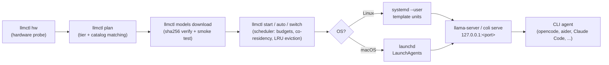
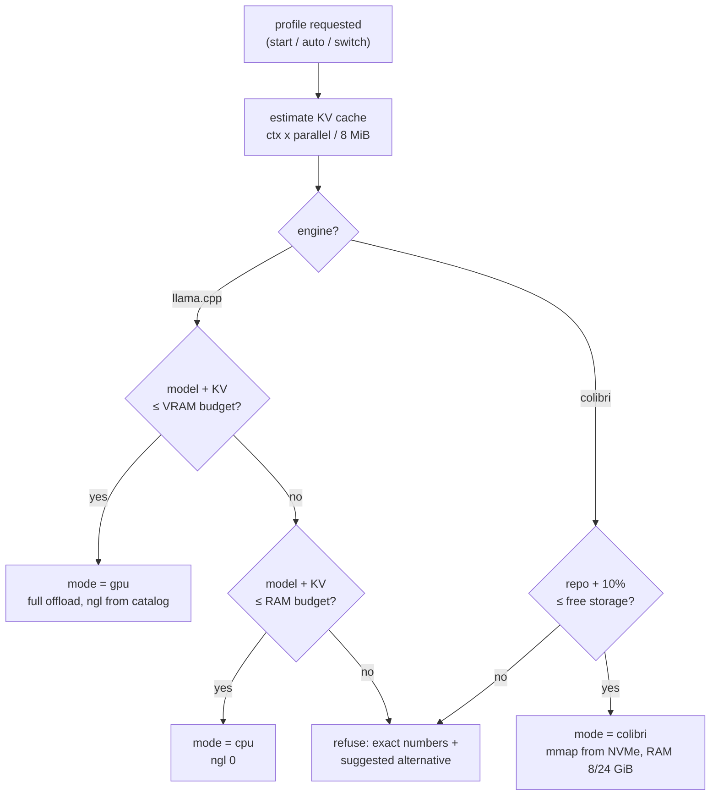
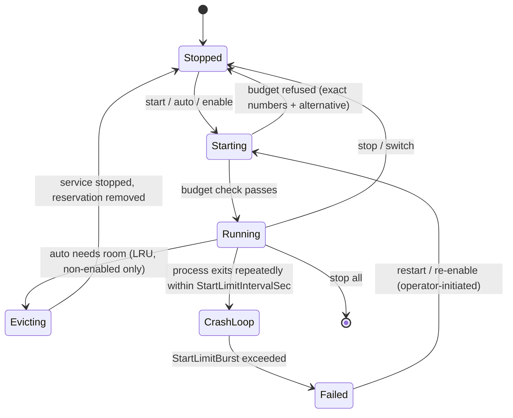
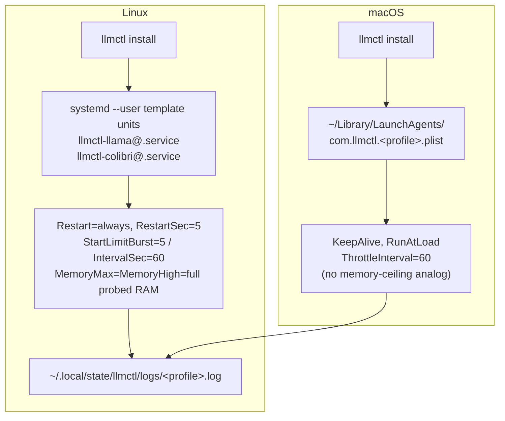
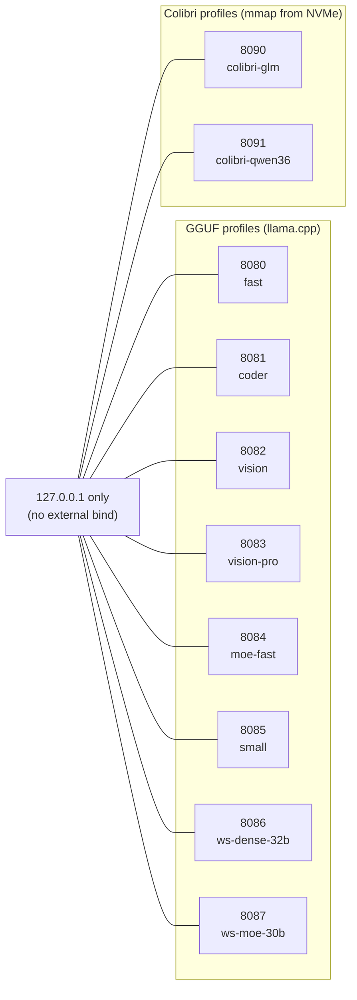

# Architecture

**Revision:** 2
**Last modified:** 2026-09-15T00:00:00Z

## Layout

```
bin/llmctl          CLI entrypoint (dispatches to the libs below)
lib/common.sh       logging/colors/die, XDG-aware paths, JSON helpers (python3)
lib/os_detect.sh    linux/macos, arch, nproc, package-manager hints
lib/hardware.sh     dynamic probe: CPU/SIMD, RAM, GPUs, storage type
lib/catalog.sh      catalog queries + the hardware planner
lib/download.sh     resumable, checksummed downloads + smoke tests + evidence
lib/engine.sh       llama.cpp / colibri builds from pinned submodules
lib/scheduler.sh    co-residency, switching, auto (LRU eviction)
lib/service_linux.sh  systemd --user template units + linger
lib/service_macos.sh  launchd LaunchAgents
lib/doctor.sh       environment self-diagnosis
models/catalog.json profiles with real sha256 + byte sizes (HF API-sourced)
tests/              deterministic harness + fixtures
submodules/         llama.cpp v0.4.0, colibri v1.11.0 (git submodules)
llmctld/            opt-in Go cluster daemon (Phase 2 scaffolding only —
                    internal/cluster, internal/raft, internal/mtls,
                    internal/audit; no HTTP API routes exist yet, see
                    docs/cluster-architecture.md's honest boundary)
```

Data flow: `hw` (probe) → `plan` (planner) → `models download` (verified
fetch + smoke test) → `start/auto/switch` (scheduler) → service backend
(systemd `--user` or launchd, chosen by OS).



## Memory model (planner)

Deliberately simple and conservative:

* RAM budget = `MemAvailable − 4 GiB` headroom.
* VRAM budget = `total VRAM × 0.85` (15% headroom).
* KV cache estimate = `ctx_tokens × parallel_slots / 8` MiB — a conservative
  upper estimate for f16 KV across the catalog's architectures.
* GGUF profiles choose between exactly two modes:
  `gpu` (full offload, `ngl` from catalog defaults, 2 GiB host RAM) when
  `model + KV ≤ VRAM budget`, else `cpu` (`ngl 0`) when
  `model + KV ≤ RAM budget`, else the profile does not fit.
* Colibri profiles memory-map weights from NVMe: VRAM 0, RAM reservation
  8 GiB (<100 GiB repos) or 24 GiB (larger), storage must fit the repo +10%.

Co-residency groups are computed by greedy bin-packing of the recommended
profiles (in port order) against both budgets.

**Note on the two distinct memory-budget mechanisms in this project** (an
operator decision recorded 2026-09-15, Phase 6/T035): the planner's RAM/VRAM
*budgets* above are an **admission-control** check — they decide whether
llmctl should let a *new* profile start alongside what is *already running*,
to avoid overcommitting across several co-resident profiles (thrashing/swap
death would hurt every running profile's performance, which is the opposite
of this project's goal). This is deliberately unrelated to, and NOT the same
mechanism as, the systemd/launchd `MemoryMax`/`MemoryHigh` OS-level ceiling
described in "Service backends" below, which governs one *already-running*
service's own hard resource limit.



## Scheduler state

* `~/.local/state/llmctl/services/<profile>.env` — launch parameters
  (systemd `EnvironmentFile`; also the record the macOS plist is rendered
  from). `<profile>.enabled` marks autostart-enabled services.
* `$XDG_RUNTIME_DIR/llmctl/<profile>.run` (fallback
  `~/.local/state/llmctl/run/`) — reservation record of a running service:
  mode, port, reserved RAM/VRAM MiB, start epoch.

`start` re-probes hardware, subtracts live reservations, and refuses with
exact numbers + a fitting alternative when the combined footprint exceeds the
budgets. `auto <capability>` picks the best-ranked recommended profile per
capability (fixed ranking tables in `sched_rank_for_capability`) and, when
space is short, evicts **non-enabled** services oldest-first (LRU).
`switch` stops everything and starts exactly one profile. Every scheduler
mutation acquires `scheduler::with_lock` (an advisory `flock`) first, so two
concurrent `llmctl` invocations (e.g. a cron job racing an interactive user)
never lose an update — the second waits, re-reads state after the first
releases, then proceeds (proven by `tests/test_scheduler_lock.sh`: 200
concurrent increments lose zero updates).



## Service backends

* Linux: two template units `llmctl-llama@.service` /
  `llmctl-colibri@.service` installed into `~/.config/systemd/user/`.
  `Restart=always`, `RestartSec=5`, bounded restarts via
  `StartLimitBurst=5` within `StartLimitIntervalSec=60` (once exceeded the
  unit stops and `llmctl status` reports `failed (crash-loop)` with the
  last captured log line, rather than looping forever — Constitution
  Clarification 14). `MemoryHigh`/`MemoryMax` = the full probed total
  system RAM (an operator decision, 2026-09-15: no artificial ceiling below
  hardware capacity — see the memory-model note above; the directives still
  cgroup-contain a runaway profile to a clean OOM-kill of just that service
  rather than an uncontrolled whole-host kernel OOM event). Logs appended
  to `~/.local/state/llmctl/logs/<profile>.log`, linger enabled via
  `loginctl enable-linger` (with a sudo fallback hint).
* macOS: `~/Library/LaunchAgents/com.llmctl.<profile>.plist` with
  `KeepAlive`, a widened `ThrottleInterval=60` (launchd has no native
  give-up-after-N-restarts mechanism the way systemd's `StartLimitBurst`
  does — this is an honest, documented platform-parity gap; the 60s
  interval bounds the *rate* of restarts, not the total attempt count),
  `RunAtLoad`, the same log paths. launchd has no clean per-process
  memory-ceiling analog to systemd's cgroup `MemoryMax`/`MemoryHigh`, so no
  equivalent directive is set on macOS.

Both backends honor `LLMCTL_DRY_RUN=1`: files are generated for real,
process-management calls are printed instead of executed.



## Port map

Fixed per profile (documented in README/integrations): 8080 fast, 8081 coder,
8082 vision, 8083 vision-pro, 8084 moe-fast, 8085 small, 8086 ws-dense-32b,
8087 ws-moe-30b, 8090 colibri-glm, 8091 colibri-qwen36. All services bind to
`127.0.0.1` only.


