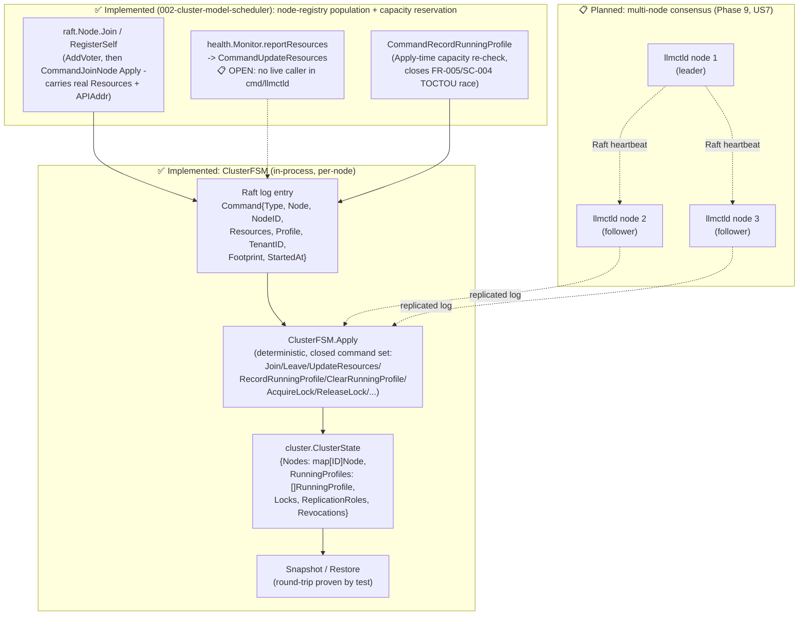
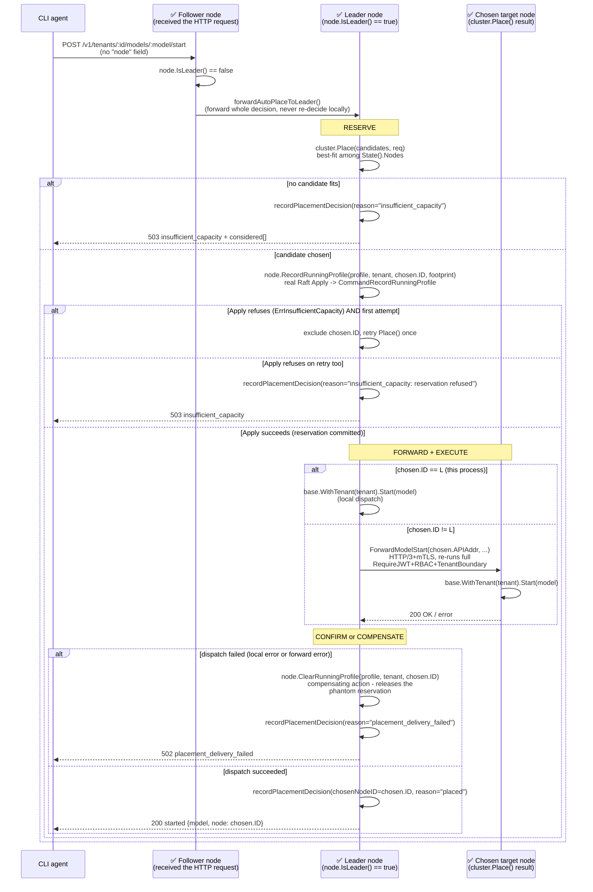
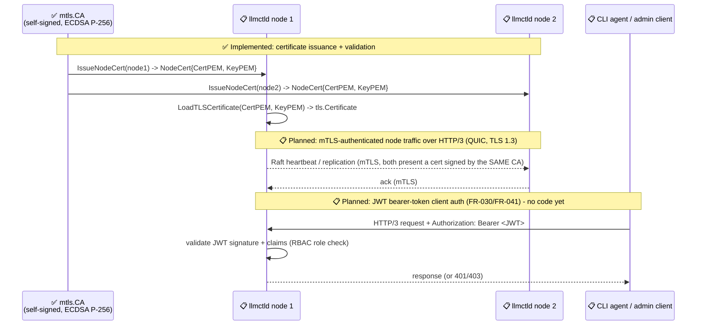
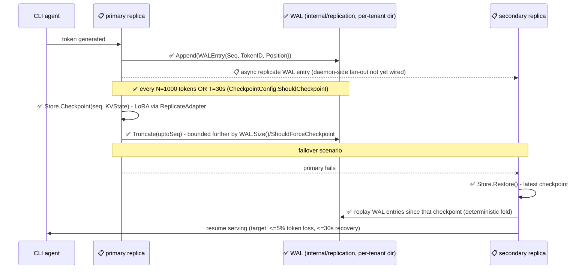
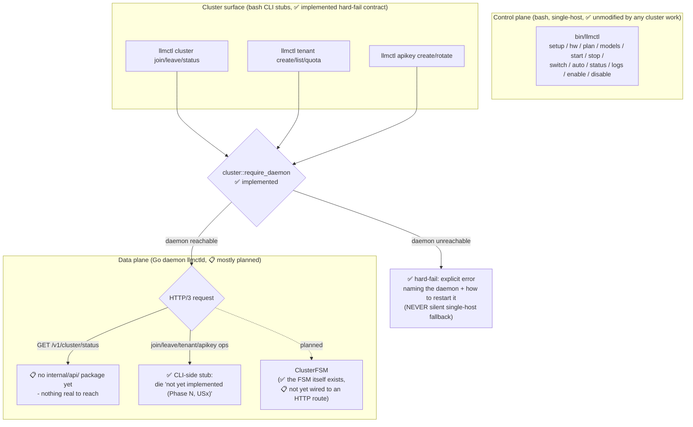
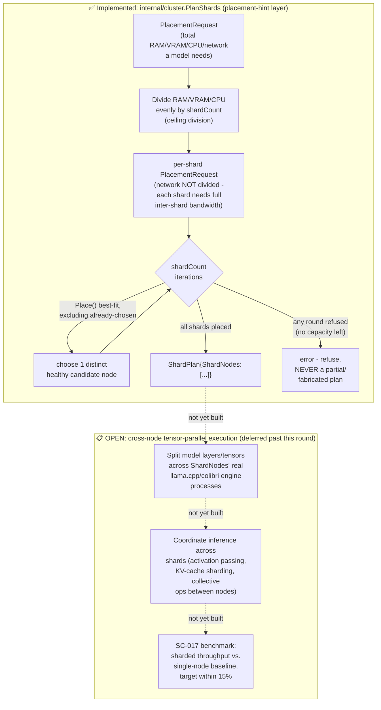

# Cluster Architecture (`llmctld`)

**Revision:** 4
**Last modified:** 2026-09-16T00:00:00Z

`llmctld` is an **opt-in** Go daemon (Gin Gonic, HTTP/3/QUIC, Brotli
compression) that will provide distributed multi-host scheduler
coordination, Raft consensus, KV-cache replication, JWT/RBAC auth, and
tamper-evident audit logging (spec.md FR-039/FR-040/FR-041, Clarification
9/10/11). **Single-host `bin/llmctl` bash CLI is completely unmodified and
never depends on `llmctld`** — the daemon is only consulted when cluster
mode is explicitly enabled (`llmctl cluster ...`), and `cluster::require_daemon`
hard-fails with an explicit error rather than silently falling back to
single-host scheduling when no daemon is reachable (Clarification 12).

## Honest implementation-status boundary (Constitution §11.4.6 — read this first)

This document diagrams BOTH what exists today AND what spec.md designs for
later phases. **Every diagram below is explicitly labeled** with one of two
states, and neither is presented as the other:

- **✅ IMPLEMENTED** — real Go code exists under `llmctld/internal/`, with
  passing tests, as of this session (verified via `find llmctld -name
  '*.go'`, which currently returns only: `cmd/llmctld/main.go` (a version-only
  stub), `internal/cluster/{state,state_test}.go`, `internal/raft/{fsm,fsm_test,testhelpers_test}.go`,
  `internal/mtls/{certs,certs_test}.go`, `internal/audit/{log,log_test}.go`).
- **📋 PLANNED (not yet implemented)** — described by spec.md's functional
  requirements and data model, but no Go code implements it yet. There is
  currently **no `internal/api/` package, no HTTP route of any kind, no
  JWT/RBAC code, no KV-cache/WAL/checkpoint code, and no tenant/quota code**
  in this repository. These diagrams show the DESIGNED shape so implementers
  in later phases (9, 10, 11) have a target — they are not a claim that any
  of this runs today.

## 1. Raft cluster topology — ✅ IMPLEMENTED (node membership + cluster-wide model-placement scheduling primitives) / 📋 PLANNED (real multi-node leader election + log replication over a production network)

**Revision 4 update (feature `002-cluster-model-scheduler`, Phases 1–5, all
merged to `main` as of this revision — tracked as follow-up item `T072-FU6`
in `specs/001-llmctl-completion/tasks.md`'s Follow-up Work section).** This
feature closed the exact gap Revision 3 documented above as 📋 PLANNED
under "scheduler-state coordination (which models run where)": `Join`/
`Leave` now genuinely populate `ClusterState.Nodes`, each node's resources
can be refreshed after join time, and a new Raft-replicated
**cluster-wide running-profile index** makes "start a model without
knowing which node has room" a real, race-safe operation. What remains
📋 PLANNED is unchanged from Revision 3: an actual running multi-node
Raft cluster over a real network (leader election, log replication across
physically distinct hosts) — every mechanism below is proven today via
real Go processes on `localhost` (contract + `test/integration/`
multi-process tests), never a live multi-host deployment.

What's real today (unchanged from Revision 3): `internal/raft.ClusterFSM`
wraps `hashicorp/raft` (Clarification 10 — no external etcd/consul) and
implements the `Apply` half of the FSM interface for a closed set of
command types — an unrecognized command type is rejected, never silently
ignored. `Apply` is proven deterministic: replaying the same log sequence
into a fresh FSM always produces byte-identical state
(`TestApply_DeterministicGivenSameLogSequence`,
`llmctld/internal/raft/fsm_test.go:51`), which is the correctness property
every node's independent log replay depends on — this feature *extended*
that same replay-determinism test to additionally cover
`CommandUpdateResources`/`CommandRecordRunningProfile`/
`CommandClearRunningProfile` (T007/T010), rather than adding a second,
parallel determinism test. Snapshot/Restore round-trip correctly (proven
by test, unchanged).

*(Diagram genuinely rendered via `mmdc` this revision, confirmed real
non-degenerate SVG output — 27,007 bytes, one `<svg>` root element — using
`mmdc -p <puppeteer-no-sandbox-config> -i <this diagram> -o out.svg`; this
sandbox's Chromium requires an explicit `--no-sandbox` Puppeteer flag due to
the container's AppArmor unprivileged-userns restriction — `mmdc` itself
was already installed at `~/.nvm/versions/node/v26.8.1/bin/mmdc`
(`@mermaid-js/mermaid-cli@11.17.0`), matching T041/T057's established
discipline, not assumed-valid syntax.)*

### 1a. Node-registry population fix (002-cluster-model-scheduler, Phase 2, T004/T005)

Before this feature, `raft.Node.Join`/`Leave` only ever mutated
`hashicorp/raft`'s own membership configuration (`AddVoter`/
`RemoveServer`) — `ClusterState.Nodes`, the map `cluster.Place`'s
candidate-selection logic reads, never observed *any* join or leave, no
matter how many peers had actually joined the Raft cluster. A start
request naming no node therefore had zero real candidates to place onto,
regardless of cluster size — this was the load-bearing gap this whole
feature exists to close, confirmed via source-reading before any code
changed (`research.md` Decision 3, T003's own verification task).

`Join(peerID, peerAddr, apiAddr string, resources cluster.Resources) error`
(`llmctld/internal/raft/node.go:173`) now applies a real
`CommandJoinNode` log entry *after* `AddVoter` succeeds
(`node.go:174,179-184`), carrying the peer's real `Resources` and its
separate cluster-API bind address (`APIAddr`, distinct from the Raft
transport `Addr` — `internal/cluster/state.go:13-22`'s own doc comment
explains why cross-node forwarding must dial `APIAddr`, never `Addr`).
`RegisterSelf` (`node.go:200-207`) is the bootstrap-leader's own
equivalent — a freshly-bootstrapped leader was otherwise silently absent
from its own `ClusterState.Nodes`. `Leave() error`
(`node.go:234-245`) applies `CommandLeaveNode` *before* calling
`RemoveServer`, deliberately the reverse order of `Join` — `RemoveServer`
against a leader's own ID triggers that leader's immediate self-shutdown
the instant the removal commits, so the state mutation must land first
while the node is still fully operational (a genuine RED discovered via
this exact TDD cycle: the originally-specified "Apply after RemoveServer"
order reproducibly failed with "raft is already shutdown" on every run).
Every call site of the changed `Join` signature (`routes_cluster.go`'s
`POST /v1/cluster/join` handler, `client.go`'s `RequestJoin`, and
`cmd/llmctld/main.go`'s `cluster join` subcommand) was updated in the same
task (T006) with every pre-existing test at each call site still passing
unmodified in behavior.

Proven by `TestApply_JoinNode_PopulatesClusterStateNodes` and
`TestApply_LeaveNode_RemovesFromClusterStateNodes`
(`fsm_test.go:107`, `fsm_test.go:124` — verification-only, T003 confirmed
the FSM's own `Apply` cases were already correct before this feature
started) plus the real end-to-end proof,
`TestJoin_PopulatesRealClusterStateNodesEntry` /
`TestLeave_RemovesRealClusterStateNodesEntry` in `node_test.go`, both
confirmed RED against the pre-fix `Join`/`Leave` before the fix landed.

### 1b. Resource-freshness heartbeat — ✅ MECHANISM IMPLEMENTED / 📋 OPEN (not wired into the running `llmctld` binary)

`CommandUpdateResources` (`fsm.go:33`, `Apply` case `fsm.go:326-332`)
refreshes an already-known node's `Resources` in place, refusing with a
distinct error (`errUpdateResourcesUnknownNode`) if the node isn't a
current member — never silently accepted. `internal/cluster/health.go`'s
`Monitor` gained three new pieces to drive this on its existing 10-second
tick (`DefaultHealthCheckInterval`, `health.go:59` — no second ticker
introduced): a `ResourceSource` function type
(`health.go:37-43`, returns this node's own current hardware-probe-derived
capacity), a `ResourceSubmitter` function type
(`health.go:45-56`, submits it via a real `CommandUpdateResources` Apply —
locally if this node is the leader, forwarded to the leader over the
existing HTTP/3+mTLS channel otherwise, per the doc comment's own design),
and `SetResourceReporting`/`reportResources`
(`health.go:117-130` / `health.go:132+`) wiring the two together on every
tick.

**Honest scope boundary (Constitution §11.4.223 provenance markers) —
verified, not assumed:** `TestMonitor_PeriodicTick_SubmitsResourceUpdate`
(`health_test.go:314`) proves this mechanism against *injected fakes* —
it does **not** prove anything is actually calling it in the real
`llmctld` binary. A repository-wide search
(`grep -rn "cluster.NewMonitor\|NewMonitor\|SetResourceReporting"
--include="*.go" . `, excluding `_test.go` files) returns **zero non-test
callers** — `cmd/llmctld/main.go` (816 lines) never constructs a
`cluster.Monitor` at all, for *any* purpose (health-checking,
rescheduling, or this resource heartbeat). This is the exact same
honest-gap pattern already disclosed for `internal/replication`'s
WAL/Store in §3 above ("real, tested library primitives with no live
caller in the running binary yet") and, per that section's own text, for
`internal/cluster/health.go`/`placement.go` themselves since Phase 9 —
this revision confirms the gap still holds for the new resource-heartbeat
addition specifically, rather than silently assuming Phase 9's disclosure
covered functionality that did not exist yet at the time it was written.
Wiring `Monitor.Start()` + `SetResourceReporting` into `cmd/llmctld/main.go`
so a running daemon actually ticks this on a live 3+-node cluster is
tracked as open follow-up work (`T072-FU6`'s own honest-boundary
disclosure), not claimed done here.

### 1c. Reservation-based automatic placement flow (002-cluster-model-scheduler, Phases 3–4) — ✅ IMPLEMENTED

`POST /v1/tenants/:id/models/:model/start` (and the analogous `stop`/
`status` routes, Phase 4) accepts an optional `node` field
(`internal/api/routes_models.go:1-86`'s own doc comment is the canonical
description of every branch below). When `node` is present, or no
`*raft.Node` was wired into this daemon at all (a single, non-clustered
deployment), dispatch is **byte-identical** to this route's pre-Phase-3
behavior — it never enters `cluster.Place()` (T019's own guarantee,
re-confirmed unmodified via the already-passing T072-FU4 tests). When
`node` is absent and a `*raft.Node` **is** wired, `dispatchAutoPlacedStart`
(`routes_models.go:257-371`) runs the reserve → forward → execute →
confirm sequence below.

*(Genuinely rendered via `mmdc` this revision, confirmed real
non-degenerate SVG output — 41,372 bytes, one `<svg>` root element,
same `--no-sandbox` Puppeteer workaround as §1's diagram above.)*

**Reserve** (T016, `routes_models.go:310-331`): the chosen node's capacity
is reserved via a real `node.RecordRunningProfile` Raft `Apply`
(`internal/raft/running_profile.go:18-43`) **before** anything is
dispatched — `CommandRecordRunningProfile`'s `Apply` case
(`fsm.go:333-366`) re-derives the node's currently-uncommitted capacity by
summing every already-committed `RunningProfile.Footprint` against that
`NodeID` purely from replicated state (never from the caller's own
pre-check), refusing with `ErrInsufficientCapacity` (`fsm.go:180`) if the
footprint no longer fits. This Apply-time re-validation — not the
caller-side `cluster.Place()` bin-packing that runs first — is what
genuinely closes the FR-005/SC-004 TOCTOU race: two concurrent proposers
may both have observed "node fits" against a stale snapshot, but
`hashicorp/raft` applies log entries strictly one at a time, so whichever
`Apply` runs second always sees the first one's committed reservation and
is refused. On a first-attempt refusal, the handler retries `Place()`
exactly once against freshly-read state, excluding the now-known-full
node (`routes_models.go:316-321`); a second refusal, or any other
placement failure, returns `insufficient_capacity` with a
`considered` snapshot of every node's capacity at decision time
(`nodeCapacitySnapshots`, `routes_models.go:621-633`).

**Forward + execute** (T017): a non-leader follower receiving the
original HTTP request forwards the *entire* auto-placement decision to
the real Raft leader (`forwardAutoPlaceToLeader`,
`routes_models.go:267-268,382+`) rather than attempting to place or
reserve locally — `RecordRunningProfile` is a real Raft write, valid only
on the current leader. Once the leader has reserved capacity on a chosen
node, dispatch is local (`base.WithTenant(tenant).Start(model)`) if the
chosen node *is* the leader itself, or forwarded via
`ForwardModelStart` (`internal/api/client.go:150-190`) — a real
HTTP/3+mTLS request to the chosen node's own `APIAddr` — otherwise. The
receiving node re-runs its **own** full `RequireJWT` + `authorizeTenantOwnership`
+ `CheckRBAC` + `CheckTenantBoundary` gate chain against the forwarded
`Authorization` header, never trusting "the sending node already
authorized this" (`client.go:142-149`'s own doc comment).

**Confirm or compensate** (T017's compensating action,
`routes_models.go:345-357`): a dispatch failure — either the local start
erroring, or the forwarding HTTP call failing — triggers a real
`node.ClearRunningProfile` Apply (`fsm.go:367-375`'s
`CommandClearRunningProfile` case, idempotent on an already-absent entry,
matching `CommandReleaseLock`'s own established idempotent-release
pattern) **before** the error is returned to the caller as
`placement_delivery_failed`. Without this compensating clear, a failed
dispatch would leave a "phantom" reservation permanently blocking future
placement onto that node's genuinely-available capacity — this is the
one branch of the whole flow where skipping the step would silently
corrupt the cluster-wide running-profile index (§1d below) rather than
merely failing one request. Every outcome — success, refused placement,
refused reservation, or failed delivery — is recorded as a
`PlacementDecision` audit entry via `recordPlacementDecision`
(`routes_models.go:645-658`, `internal/cluster/placement_decision.go:32-38`)
through `internal/audit/log.go`'s existing hash-chained `Append` mechanism
(`log.go:59`) — deliberately *not* a new Raft-replicated command, per
`data-model.md`'s own "Concurrency-safety note" placing `PlacementDecision`
outside `ClusterState`.

Proven end-to-end by real multi-process integration tests in
`test/integration/cluster_placement_test.go` — no mocks, real HTTP over
real bootstrapped `raft.Node` processes:
`TestClusterPlacement_StartWithoutNode_LandsOnNodeWithCapacity`
(`:200`), `TestClusterPlacement_NoNodeHasCapacity_RefusedWithExactShortfall`
(`:276`), `TestClusterPlacement_ConcurrentStarts_NeverDoubleBookANode`
(`:787`, run at ≥10 iterations per Constitution §11.4.50's
deterministic-consistency discipline), and
`TestClusterPlacement_DecisionIsReconstructableAfterTheFact` (`:876`,
retrieves a real `PlacementDecision` via `internal/audit/log.go`'s
existing read path and asserts every `data-model.md`-specified field is
present and matches the real decision made).

### 1d. Cluster-wide running-profile index (002-cluster-model-scheduler, T009/T023/T024) — ✅ IMPLEMENTED

`ClusterState.RunningProfiles []RunningProfile`
(`internal/cluster/state.go:209`, entry shape `state.go:41-60`) is the
Raft-replicated index of every profile instance currently known to be
running on some node, across the whole cluster — a slice, deliberately
never a single-valued map keyed by profile name, because `(Profile,
TenantID)` may map to more than one `NodeID` simultaneously (spec.md's
Edge Cases explicitly requires this be *reported*, never silently
collapsed to one — `state.go:37-40`'s own doc comment). `Clone()`
(`state.go:239-263`) deep-copies the slice so callers reading cluster
state never race the FSM's own `Apply` goroutine, proven by
`TestClone_RunningProfilesIsIndependentCopy`
(`internal/cluster/state_test.go:32`).

Consumers: (1) `GET /v1/cluster/status`
(`internal/api/routes_cluster.go:111-120`) includes `running_profiles`
straight from `state.RunningProfiles` alongside the pre-existing
`is_leader`/`state` fields (T024). (2) Name-only `stop`/`status` — when a
request omits `node` — resolve every matching `(Profile, TenantID)` entry
in the index (`runningProfileMatches`, `routes_models.go:429-451`) and act
on **every** matched `NodeID`, never just the first
(`dispatchNameOnlyStop`/`dispatchNameOnlyStatus`, `routes_models.go:453+`,
`:575+`) — covering spec.md's Edge Case that a profile found on more than
one node must never be silently limited to one, proven by
`TestClusterPlacement_SameProfileOnMultipleNodes_StopActsOnAll`
(`cluster_placement_test.go:571`). Every real per-node stop success
removes that entry via `CommandClearRunningProfile`
(`routes_models.go:492-497`) — forwarded to the leader first when the
receiving node isn't it, mirroring `dispatchAutoPlacedStart`'s own
leader-forwarding exactly, since `CommandClearRunningProfile`, like
`CommandRecordRunningProfile`, is a real Raft write valid only on the
current leader.

**Authorization-parity review (T025, Constitution §11.4.125/§11.4.142):**
this feature's own review gate specifically re-confirmed every forwarded
status/stop call in this name-only resolution path still passes through
the identical `authorizeTenantOwnership`/`CheckRBAC`/`CheckTenantBoundary`
chain `T072-FU4`/`T072-FU5` established — the exact defect class (a
cross-tenant data-access gap) `T072-FU5` found and fixed elsewhere in this
codebase — before this doc considered the index's authorization posture
settled; see `T033`'s independent whole-feature review (this revision) for
the confirmation that no divergence was reintroduced since.

Proven end-to-end by
`TestClusterPlacement_NameOnlyStatusAndStop_ResolveToRealNode`
(`cluster_placement_test.go:476`) and the extended `GET
/v1/cluster/status` contract test asserting `running_profiles` accurately
reflects `ClusterState.RunningProfiles`
(`internal/api/routes_cluster_test.go`).

## 2. Node-to-node mTLS + client JWT auth flow — ✅ IMPLEMENTED (mTLS primitive) / 📋 PLANNED (JWT, wired transport)

What's real today: `internal/mtls.CA` is a self-signed internal certificate
authority (ECDSA P-256) that issues per-node leaf certificates
(`IssueNodeCert`); a node's certificate validates against its own CA and is
correctly rejected by a different CA's pool (proven by test);
`LoadTLSCertificate` loads a cert+key pair as a real `tls.Certificate`.
Certificate validity is deliberately long-lived (365 days) for this first
implementation — rotation is a tracked follow-up, not yet wired into any
node lifecycle. What's planned: actually using these certificates to
authenticate real HTTP/3 (QUIC) connections between nodes (Clarification
11), and the entire client-facing JWT bearer-token auth path (FR-030,
FR-041) — no JWT issuance, validation, or RBAC code exists yet.

## 3. KV-cache WAL/checkpoint replication sequence — ✅ IMPLEMENTED (WAL + checkpoint + LoRA replication library) / 📋 OPEN (real engine-state integration + automatic daemon-side fan-out)

Per spec.md Clarification 7 / FR-026/FR-027/FR-028: KV cache replicates
**asynchronously** via a write-ahead log, with periodic checkpoints (every
N tokens, default 1000, or every T seconds, default 30s). On failover, the
new primary restores from the latest checkpoint and replays the WAL from
that point (target: ≤5% token loss, ≤30s recovery). LoRA adapters
replicate synchronously on creation and are captured as part of each
checkpoint.

**Honest scope boundary (Constitution §11.4.223 provenance markers).**
`internal/replication` (`wal.go`/`checkpoint.go`/`lora.go`) is real, TDD-tested
library code implementing the WAL + checkpoint + LoRA-adapter-replication
mechanics against a `KVState{Tokens, Positions []int32}` abstraction — the
REPLAYABLE TOKEN SEQUENCE, not raw engine-internal attention-weight bytes.
This is a deliberate, documented choice, not an oversight: llmctld's
control-plane/data-plane split means the real inference engine
(`llama.cpp`/`colibri`) always runs as a separate OS process, reached only
via its OpenAI-compatible HTTP API — never something llmctld can
memory-snapshot directly.

**A real, concrete future integration point exists and was found by
reading the actual vendored source** (`submodules/llama.cpp`, pinned at
`3f152073` / ~b10969): `llama-server` exposes a real HTTP endpoint,
`GET /slots` + `POST /slots/:id_slot?action=save|restore` (registered in
`tools/server/server.cpp:285-286`; handled by `handle_slots_save`/
`handle_slots_restore` in `server-context.cpp:5288-5320`+, dispatching
real `SERVER_TASK_TYPE_SLOT_SAVE`/`_RESTORE` tasks from a JSON body
`{"filename": "..."}`). The underlying C API also genuinely exists
(`llama_state_get_data`/`llama_state_set_data`/`llama_state_seq_save_file`/
`llama_state_seq_load_file`, declared in `include/llama.h:814-898`), but
those are C symbols in `libllama`, reachable only from a process linked
against it (i.e. `llama-server` itself) — not from a separate Go process
without cgo, which this project's architecture deliberately avoids.
**The real constraint**: the HTTP slot-save/restore endpoint writes its
artifact to `llama-server`'s OWN local disk (`--slot-save-path` must be
set at server startup) — the HTTP response returns only metadata (slot
id, filename, token counts), never the raw state bytes. Wiring this in
for genuine cross-node replication would require llmctld to (a) start
`llama-server` with `--slot-save-path` (an `internal/executor` extension),
(b) call the real save/restore HTTP endpoint, AND (c) transfer the
resulting local file to another node's disk out-of-band (rsync-class
mechanism) — real, buildable, but additional scope beyond what T059-T064
asked for. `submodules/colibri` (pinned `7a14d837` / v1.11.0+3) has no
comparable generic mechanism — only a narrow, Kimi-K3-specific,
single-process, single-host recurrent-state checkpoint feature
(`COLI_K3_CKPT`), not a cross-node replication primitive.

**Also 📋 OPEN**: automatic daemon-side fan-out (a running `llmctld`
process automatically forwarding its own WAL entries/checkpoints to
replica nodes as tokens are generated) is not wired into `cmd/llmctld`'s
`main.go` — `internal/replication`'s `Store`/`WAL` are correct, tested
library primitives with no live caller in the running binary yet, the
same honest-gap pattern already established for Phase 9's
`internal/cluster/health.go`/`placement.go`.

## 4. Control-plane / data-plane split (bash `llmctl` + Go `llmctld`) — ✅ IMPLEMENTED (the split + the hard-fail contract) / 📋 PLANNED (the data-plane operations themselves)

What's real today: the ARCHITECTURAL SPLIT itself is implemented and
tested. `bin/llmctl` (bash, single-host) is the CONTROL surface an operator
types commands into; when cluster mode is invoked (`llmctl cluster
join|leave|status`, `llmctl tenant ...`, `llmctl apikey ...`),
`cluster::require_daemon` checks for a reachable `llmctld` and hard-fails
with an explicit, actionable error (naming the daemon and how to restart
it) if none is reachable — proven live: with no daemon running,
`cluster::require_daemon` exits 1 with that exact message, and
`llmctl cluster status` hard-fails identically (both proven by direct
tests in Phase 2, T005/T006). This is the "never silently fall back to
single-host scheduling" guarantee from Clarification 12. `llmctl cluster
status` DOES make a real HTTP request (`cluster::request GET
/v1/cluster/status`) when a daemon IS reachable — but since `llmctld`
exposes no HTTP routes yet (no `internal/api/` package exists), that
request currently has nothing real to reach; `llmctl cluster join`/`leave`
and every `tenant`/`apikey` subcommand are real CLI stubs that immediately
`die` with `"llmctld reachable but '<command>' is not yet implemented
(Phase N, USx)"`.

## 5. Tensor/model-parallelism sharding contract — ✅ IMPLEMENTED (placement hints) / 📋 OPEN (cross-node execution)

FR-022 requires tensor/model parallelism across nodes for models exceeding
a single node's VRAM; FR-024 requires model sharding across nodes for
models exceeding single-node capacity. This section documents the real,
honest split between what T057 implements and what it deliberately does
not, per Constitution §11.4.223 provenance-marker discipline.

**✅ IMPLEMENTED — `internal/cluster.PlanShards(candidates, req, shardCount)`**:
selects `shardCount` distinct healthy candidate nodes, each sized for an
even `1/shardCount` fraction of the model's RAM/VRAM/CPU requirement
(network bandwidth is deliberately NOT divided — every shard still needs
the model's full inter-shard bandwidth, since shards talk to each other,
not merely to one external caller). It reuses `Place()`'s own best-fit
selection repeatedly, excluding already-chosen nodes each round, so no
node is ever double-booked for two shards of the same model. It refuses
outright — never returning a partial or fabricated plan — when fewer than
`shardCount` candidates have sufficient per-shard capacity. Proven by
`internal/cluster/sharding_test.go`'s 3 tests (even-split distinct-node
selection, refusal on insufficient capacity, refusal on an invalid
`shardCount < 2`).

**📋 OPEN — cross-node tensor-parallel execution, deliberately deferred**:
`PlanShards` answers *which nodes could jointly host a sharded model*. It
does **not** implement the actual runtime mechanics of tensor/model
parallelism: splitting a model's layers or tensors across multiple nodes'
real `llama.cpp`/`colibri` engine processes, and coordinating inference
across them (activation/KV-cache exchange, collective communication
between shards, failure handling mid-inference). None of that exists in
this codebase. Building it requires real multi-GPU, multi-node hardware to
develop and validate against — hardware that does not exist in this
development sandbox — so it is honestly marked OPEN rather than claimed
done or silently skipped (Constitution §11.4.223).

**SC-017 benchmark status: UNCONFIRMED, not fabricated.** SC-017 asks for
sharded throughput within 15% of a single-node baseline. Measuring that
requires the OPEN execution layer above to exist and actually run —
without it, there is no real throughput to measure. No benchmark numbers
are recorded here because none were genuinely run; asserting a specific
percentage without ever having executed the workload would itself be
exactly the anti-bluff violation Constitution §11.4/§11.4.6 forbid. This
gap is tracked as future work under Phase 9's remaining scope, not
silently implied to be satisfied.

## Where this is going (roadmap pointer, not a claim of current state)

Per `specs/001-llmctl-completion/tasks.md`'s phase ordering: Phase 9 (US7)
builds the actual multi-node Raft coordination and scheduler distribution;
Phase 10 (US8) builds KV-cache WAL/checkpoint persistence and recovery;
Phase 11 (US9) builds JWT/RBAC auth, tenants, quotas, and API keys — none of
which this document claims is done. See `docs/CONTINUATION.md` for the
live phase-by-phase status table.
