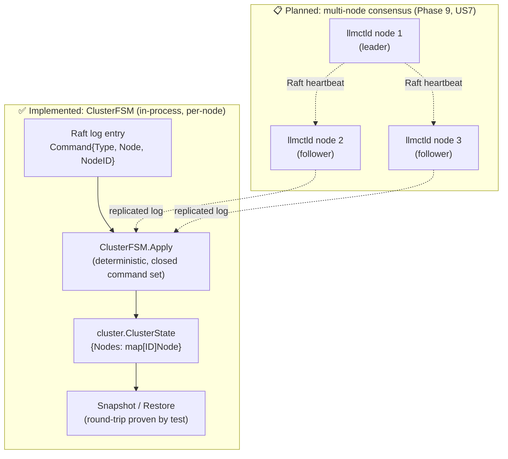
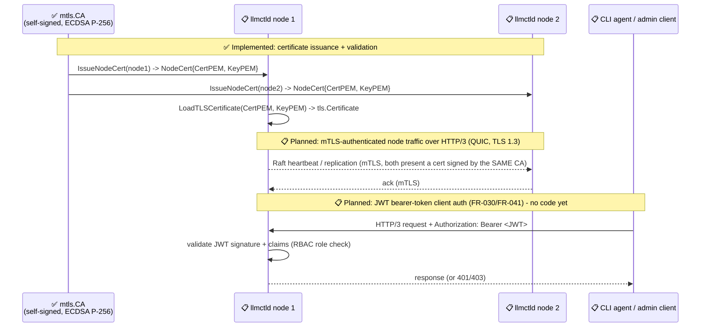
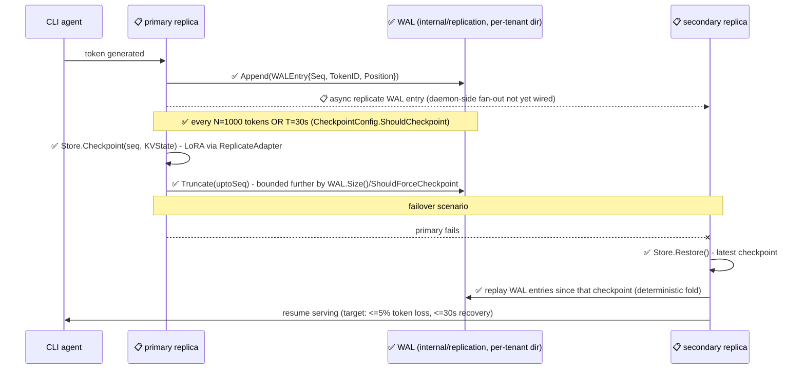
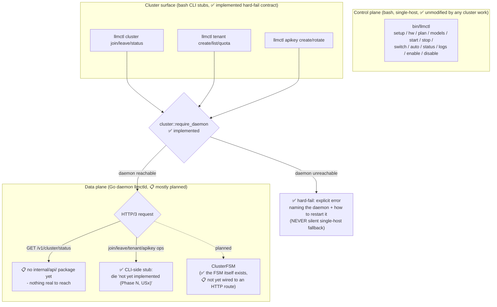
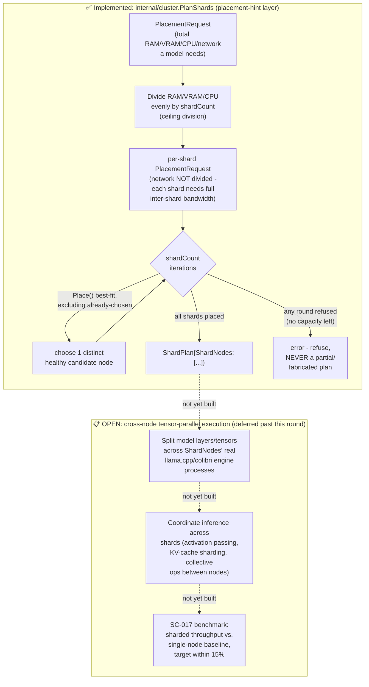

# Cluster Architecture (`llmctld`)

**Revision:** 3
**Last modified:** 2026-09-15T00:00:00Z

`llmctld` is an **opt-in** Go daemon (Gin Gonic, HTTP/3/QUIC, Brotli
compression) that will provide distributed multi-host scheduler
coordination, Raft consensus, KV-cache replication, JWT/RBAC auth, and
tamper-evident audit logging (spec.md FR-039/FR-040/FR-041, Clarification
9/10/11). **Single-host `bin/llmctl` bash CLI is completely unmodified and
never depends on `llmctld`** — the daemon is only consulted when cluster
mode is explicitly enabled (`llmctl cluster ...`), and `cluster::require_daemon`
hard-fails with an explicit error rather than silently falling back to
single-host scheduling when no daemon is reachable (Clarification 12).

## Honest implementation-status boundary (Constitution §11.4.6 — read this first)

This document diagrams BOTH what exists today AND what spec.md designs for
later phases. **Every diagram below is explicitly labeled** with one of two
states, and neither is presented as the other:

- **✅ IMPLEMENTED** — real Go code exists under `llmctld/internal/`, with
  passing tests, as of this session (verified via `find llmctld -name
  '*.go'`, which currently returns only: `cmd/llmctld/main.go` (a version-only
  stub), `internal/cluster/{state,state_test}.go`, `internal/raft/{fsm,fsm_test,testhelpers_test}.go`,
  `internal/mtls/{certs,certs_test}.go`, `internal/audit/{log,log_test}.go`).
- **📋 PLANNED (not yet implemented)** — described by spec.md's functional
  requirements and data model, but no Go code implements it yet. There is
  currently **no `internal/api/` package, no HTTP route of any kind, no
  JWT/RBAC code, no KV-cache/WAL/checkpoint code, and no tenant/quota code**
  in this repository. These diagrams show the DESIGNED shape so implementers
  in later phases (9, 10, 11) have a target — they are not a claim that any
  of this runs today.

## 1. Raft cluster topology — ✅ IMPLEMENTED (node membership) / 📋 PLANNED (scheduling coordination)

What's real today: `internal/raft.ClusterFSM` wraps `hashicorp/raft`
(Clarification 10 — no external etcd/consul) and implements the `Apply`
half of the FSM interface for exactly two command types,
`CommandJoinNode`/`CommandLeaveNode` (a closed set — an unrecognized command
type is rejected, never silently ignored). `Apply` is proven deterministic:
replaying the same log sequence into a fresh FSM always produces
byte-identical state (`TestApply_DeterministicGivenSameLogSequence`), which
is the correctness property every node's independent log replay depends on.
Snapshot/Restore round-trip correctly (proven by test). What's planned:
actual multi-node leader election, log replication over the network, and
scheduler-state coordination (which models run where) — `internal/raft`
today only exercises the FSM logic itself, in-process, against
`hashicorp/raft`'s library types; there is no running multi-node cluster.

## 2. Node-to-node mTLS + client JWT auth flow — ✅ IMPLEMENTED (mTLS primitive) / 📋 PLANNED (JWT, wired transport)

What's real today: `internal/mtls.CA` is a self-signed internal certificate
authority (ECDSA P-256) that issues per-node leaf certificates
(`IssueNodeCert`); a node's certificate validates against its own CA and is
correctly rejected by a different CA's pool (proven by test);
`LoadTLSCertificate` loads a cert+key pair as a real `tls.Certificate`.
Certificate validity is deliberately long-lived (365 days) for this first
implementation — rotation is a tracked follow-up, not yet wired into any
node lifecycle. What's planned: actually using these certificates to
authenticate real HTTP/3 (QUIC) connections between nodes (Clarification
11), and the entire client-facing JWT bearer-token auth path (FR-030,
FR-041) — no JWT issuance, validation, or RBAC code exists yet.

## 3. KV-cache WAL/checkpoint replication sequence — ✅ IMPLEMENTED (WAL + checkpoint + LoRA replication library) / 📋 OPEN (real engine-state integration + automatic daemon-side fan-out)

Per spec.md Clarification 7 / FR-026/FR-027/FR-028: KV cache replicates
**asynchronously** via a write-ahead log, with periodic checkpoints (every
N tokens, default 1000, or every T seconds, default 30s). On failover, the
new primary restores from the latest checkpoint and replays the WAL from
that point (target: ≤5% token loss, ≤30s recovery). LoRA adapters
replicate synchronously on creation and are captured as part of each
checkpoint.

**Honest scope boundary (Constitution §11.4.223 provenance markers).**
`internal/replication` (`wal.go`/`checkpoint.go`/`lora.go`) is real, TDD-tested
library code implementing the WAL + checkpoint + LoRA-adapter-replication
mechanics against a `KVState{Tokens, Positions []int32}` abstraction — the
REPLAYABLE TOKEN SEQUENCE, not raw engine-internal attention-weight bytes.
This is a deliberate, documented choice, not an oversight: llmctld's
control-plane/data-plane split means the real inference engine
(`llama.cpp`/`colibri`) always runs as a separate OS process, reached only
via its OpenAI-compatible HTTP API — never something llmctld can
memory-snapshot directly.

**A real, concrete future integration point exists and was found by
reading the actual vendored source** (`submodules/llama.cpp`, pinned at
`3f152073` / ~b10969): `llama-server` exposes a real HTTP endpoint,
`GET /slots` + `POST /slots/:id_slot?action=save|restore` (registered in
`tools/server/server.cpp:285-286`; handled by `handle_slots_save`/
`handle_slots_restore` in `server-context.cpp:5288-5320`+, dispatching
real `SERVER_TASK_TYPE_SLOT_SAVE`/`_RESTORE` tasks from a JSON body
`{"filename": "..."}`). The underlying C API also genuinely exists
(`llama_state_get_data`/`llama_state_set_data`/`llama_state_seq_save_file`/
`llama_state_seq_load_file`, declared in `include/llama.h:814-898`), but
those are C symbols in `libllama`, reachable only from a process linked
against it (i.e. `llama-server` itself) — not from a separate Go process
without cgo, which this project's architecture deliberately avoids.
**The real constraint**: the HTTP slot-save/restore endpoint writes its
artifact to `llama-server`'s OWN local disk (`--slot-save-path` must be
set at server startup) — the HTTP response returns only metadata (slot
id, filename, token counts), never the raw state bytes. Wiring this in
for genuine cross-node replication would require llmctld to (a) start
`llama-server` with `--slot-save-path` (an `internal/executor` extension),
(b) call the real save/restore HTTP endpoint, AND (c) transfer the
resulting local file to another node's disk out-of-band (rsync-class
mechanism) — real, buildable, but additional scope beyond what T059-T064
asked for. `submodules/colibri` (pinned `7a14d837` / v1.11.0+3) has no
comparable generic mechanism — only a narrow, Kimi-K3-specific,
single-process, single-host recurrent-state checkpoint feature
(`COLI_K3_CKPT`), not a cross-node replication primitive.

**Also 📋 OPEN**: automatic daemon-side fan-out (a running `llmctld`
process automatically forwarding its own WAL entries/checkpoints to
replica nodes as tokens are generated) is not wired into `cmd/llmctld`'s
`main.go` — `internal/replication`'s `Store`/`WAL` are correct, tested
library primitives with no live caller in the running binary yet, the
same honest-gap pattern already established for Phase 9's
`internal/cluster/health.go`/`placement.go`.

## 4. Control-plane / data-plane split (bash `llmctl` + Go `llmctld`) — ✅ IMPLEMENTED (the split + the hard-fail contract) / 📋 PLANNED (the data-plane operations themselves)

What's real today: the ARCHITECTURAL SPLIT itself is implemented and
tested. `bin/llmctl` (bash, single-host) is the CONTROL surface an operator
types commands into; when cluster mode is invoked (`llmctl cluster
join|leave|status`, `llmctl tenant ...`, `llmctl apikey ...`),
`cluster::require_daemon` checks for a reachable `llmctld` and hard-fails
with an explicit, actionable error (naming the daemon and how to restart
it) if none is reachable — proven live: with no daemon running,
`cluster::require_daemon` exits 1 with that exact message, and
`llmctl cluster status` hard-fails identically (both proven by direct
tests in Phase 2, T005/T006). This is the "never silently fall back to
single-host scheduling" guarantee from Clarification 12. `llmctl cluster
status` DOES make a real HTTP request (`cluster::request GET
/v1/cluster/status`) when a daemon IS reachable — but since `llmctld`
exposes no HTTP routes yet (no `internal/api/` package exists), that
request currently has nothing real to reach; `llmctl cluster join`/`leave`
and every `tenant`/`apikey` subcommand are real CLI stubs that immediately
`die` with `"llmctld reachable but '<command>' is not yet implemented
(Phase N, USx)"`.

## 5. Tensor/model-parallelism sharding contract — ✅ IMPLEMENTED (placement hints) / 📋 OPEN (cross-node execution)

FR-022 requires tensor/model parallelism across nodes for models exceeding
a single node's VRAM; FR-024 requires model sharding across nodes for
models exceeding single-node capacity. This section documents the real,
honest split between what T057 implements and what it deliberately does
not, per Constitution §11.4.223 provenance-marker discipline.

**✅ IMPLEMENTED — `internal/cluster.PlanShards(candidates, req, shardCount)`**:
selects `shardCount` distinct healthy candidate nodes, each sized for an
even `1/shardCount` fraction of the model's RAM/VRAM/CPU requirement
(network bandwidth is deliberately NOT divided — every shard still needs
the model's full inter-shard bandwidth, since shards talk to each other,
not merely to one external caller). It reuses `Place()`'s own best-fit
selection repeatedly, excluding already-chosen nodes each round, so no
node is ever double-booked for two shards of the same model. It refuses
outright — never returning a partial or fabricated plan — when fewer than
`shardCount` candidates have sufficient per-shard capacity. Proven by
`internal/cluster/sharding_test.go`'s 3 tests (even-split distinct-node
selection, refusal on insufficient capacity, refusal on an invalid
`shardCount < 2`).

**📋 OPEN — cross-node tensor-parallel execution, deliberately deferred**:
`PlanShards` answers *which nodes could jointly host a sharded model*. It
does **not** implement the actual runtime mechanics of tensor/model
parallelism: splitting a model's layers or tensors across multiple nodes'
real `llama.cpp`/`colibri` engine processes, and coordinating inference
across them (activation/KV-cache exchange, collective communication
between shards, failure handling mid-inference). None of that exists in
this codebase. Building it requires real multi-GPU, multi-node hardware to
develop and validate against — hardware that does not exist in this
development sandbox — so it is honestly marked OPEN rather than claimed
done or silently skipped (Constitution §11.4.223).

**SC-017 benchmark status: UNCONFIRMED, not fabricated.** SC-017 asks for
sharded throughput within 15% of a single-node baseline. Measuring that
requires the OPEN execution layer above to exist and actually run —
without it, there is no real throughput to measure. No benchmark numbers
are recorded here because none were genuinely run; asserting a specific
percentage without ever having executed the workload would itself be
exactly the anti-bluff violation Constitution §11.4/§11.4.6 forbid. This
gap is tracked as future work under Phase 9's remaining scope, not
silently implied to be satisfied.

## Where this is going (roadmap pointer, not a claim of current state)

Per `specs/001-llmctl-completion/tasks.md`'s phase ordering: Phase 9 (US7)
builds the actual multi-node Raft coordination and scheduler distribution;
Phase 10 (US8) builds KV-cache WAL/checkpoint persistence and recovery;
Phase 11 (US9) builds JWT/RBAC auth, tenants, quotas, and API keys — none of
which this document claims is done. See `docs/CONTINUATION.md` for the
live phase-by-phase status table.
