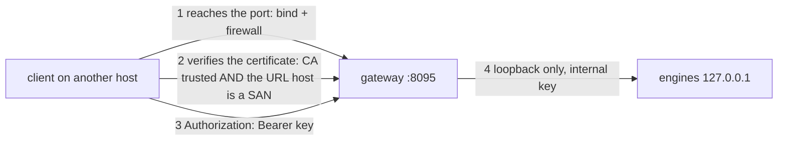
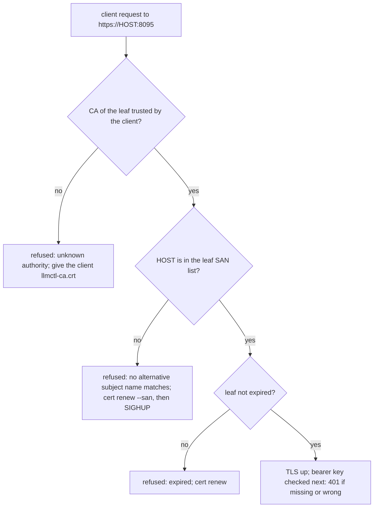

# Serving the decision gateway to other machines on your LAN

**Revision:** 1 - 2026-10-09. For `llmctl decide serve` (HTTPS, default port 8095) reached from another host on a trusted network. Going beyond the LAN (VPN, port-forward, reverse proxy, tunnel service)
is [cloud-exposure](cloud-exposure.md); keys and certificates in depth are [tls-and-keys](tls-and-keys.md); making the gateway start at boot is [persistent-services](persistent-services.md).
The chat engines (llama-server, colibri) are **never** exposed this way: they are unauthenticated or loopback-only.

Contents: [The four things that must line up](#the-four-things-that-must-line-up) | [Server side](#server-side) | [Client side](#client-side) |
[Why a name or address fails verification (the nezha experience)](#why-a-name-or-address-fails-verification-the-nezha-experience) | [Firewall](#firewall) | [Checklist](#checklist)

## The four things that must line up



1. **Bind address.** The gateway binds `0.0.0.0` (all interfaces) unless `LLMCTL_DECIDE_BIND` (or the global `LLMCTL_BIND_HOST`) says otherwise: the default `llmctl-decide serve --help` text reads
   `bind address (default $LLMCTL_DECIDE_BIND, then $LLMCTL_BIND_HOST, then 0.0.0.0)`. So out of the box it *is* reachable from the LAN, and a host that must not serve the LAN has to set `LLMCTL_DECIDE_BIND=127.0.0.1`.
   (The README's "local-only" wording refers to the engines; the gateway is the one component designed to face a network.)
2. **Certificate names.** Clients verify that the host in the URL appears in the certificate's subject alternative names (SAN) *and* that the CA is trusted.
3. **Access key.** Every `/v1/*` request needs `Authorization: Bearer <key>`; `/healthz` and `/readyz` are open and say only alive/ready.
4. **Engines stay on loopback.** The gateway reaches them over `127.0.0.1` with a separate internal key; nothing about the LAN setup changes that.

## Server side

```bash
# 1. which names/addresses does the current certificate cover?
llmctl decide cert show | grep -E '^(sans|days_left)'
#   sans  anton,localhost,127.0.0.1,::1,192.168.1.115          (host name + addresses detected at issue time)

# 2. add what your clients will type: the host name, the .local name, the fixed LAN address
export LLMCTL_TLS_SAN="dns:gw.local,ip:192.168.1.50"
llmctl decide cert renew --san "$LLMCTL_TLS_SAN"
llmctl decide cert show | grep '^sans'
#   sans  anton,localhost,gw.local,127.0.0.1,::1,192.168.1.115,192.168.1.50

# 3. make the running gateway serve the new leaf (it does NOT pick it up by itself)
kill -HUP "$(awk '{print $1}' "$LLMCTL_STATE_DIR/decide/gateway.pid")"      # or: systemctl --user restart llmctl-decide-gateway.service

# 4. export the PUBLIC CA certificate for the clients (mode 0644, safe to copy)
llmctl decide cert export ./llmctl-ca.crt

# 5. the key travels separately, over a channel you trust
llmctl decide key show --yes-print        # to a terminal you control; never into a chat, ticket or git
```

Observed on a scratch installation (real binary, temp `LLMCTL_HOME`, loopback bind, port 18995; the live host's certificate was not changed):

* After `cert renew --san dns:lan.local,ip:10.9.8.7` the handshake still presented the **old** names until `kill -HUP`; afterwards it presented `DNS:anton, DNS:localhost, DNS:lan.local, IP Address:127.0.0.1, ..., IP Address:192.168.1.115, IP Address:10.9.8.7`.
* **Pass the SAN list on every renewal.** A later plain `cert renew` dropped the earlier extra names (details in [runbooks](runbooks.md#renew--reload-the-certificate)).
* **Only LAN-class names are allowed by the default CA.** `--san dns:lan.example` was refused (`DNS name "lan.example" is not permitted by any constraint`, exit 5). Permitted: `localhost`, `*.local`, the host name, loopback,
  `10.0.0.0/8`, `172.16.0.0/12`, `192.168.0.0/16`, the IPv6 ULA range, `100.64.0.0/10`. A DNS name under your own domain needs a CA created with that name in `LLMCTL_TLS_SAN` (or `LLMCTL_CA_NAME_CONSTRAINTS=off` before the CA is created; that is a deliberate opt-out). Changing the CA means every client must re-trust it.
* Make the settings stick across restarts of the service: `LLMCTL_DECIDE_BIND` / `LLMCTL_DECIDE_PORT` in `gateway.conf` ([persistent-services](persistent-services.md#gatewayconf)). Whether a value of `LLMCTL_TLS_SAN` placed in `gateway.conf` is used for automatic certificate issuance at service start is **UNCONFIRMED**; run `cert renew --san ...` explicitly.

## Client side

```bash
# trust: either per call ...
curl --cacert ./llmctl-ca.crt -H "Authorization: Bearer $LLMCTL_API_KEY" https://gw.local:8095/v1/models
# ... or for llmctl's own client
export LLMCTL_ENDPOINT=https://gw.local:8095 LLMCTL_CACERT=$PWD/llmctl-ca.crt LLMCTL_API_KEY=...   # key from a file or secret store, not a literal in history
llmctl decide models
```

* llmctl's client has no switch that disables certificate verification, by design; hosted SDKs and `curl -k` do, and using them hides exactly the failure this page is about.
* `*.local` names need working mDNS **and a cgo-built client**. Root cause (reproduced on anton against `https://nezha.local:8095`): a `CGO_ENABLED=0` (static, e.g. cross-built) `llmctl-decide` uses Go's pure resolver, which never consults `/etc/nsswitch.conf`'s `mdns4_minimal`, so the name does not resolve (`getent hosts nezha.local` and `curl` work because they go through glibc). The same source built with `CGO_ENABLED=1` (what `llmctl build decide` does on a host with gcc) resolves it and proceeds to TLS; `GODEBUG=netdns=cgo` and `//go:debug netdns=cgo` do **not** rescue a static build, since without cgo there is no libc resolver to switch to. The client now says so (`the host name did not resolve ... .local names need mDNS`) instead of a bare "unreachable". Fixes: build the client natively with cgo, or use the gateway's IP address, or an `/etc/hosts` entry (`192.168.1.90 nezha.local`).
* Rotate the key after a client machine is lost or the key was pasted anywhere: [runbooks](runbooks.md#rotate-the-access-key). Clients that took the key from a file pick up a rotation as soon as they re-read it.

## Why a name or address fails verification (the nezha experience)

What the operator reported for nezha (a CPU-only host whose gateway was called from anton over the LAN): a request to `https://nezha.local:8095` or `https://192.168.1.90:8095` failed
certificate verification until the leaf was re-issued with the names the clients actually used (operator report). Verification does not compare "the host I reached" with anything the gateway says; it compares the **name or address in the URL** with the certificate's SAN list, so
a certificate that covers `nezha` and `127.0.0.1` but not `nezha.local` or `192.168.1.90` is refused by a correct client.

What the captured evidence shows (`specs/009-jev-decision-models/evidence/persistent-services/nezha-2026-10-09/README.md`, addendum item 3; `.../cert-show-after-reissue.out`; `portability-nezha/lan-client-from-host.txt`):

* the fix: `llmctl decide cert renew --san dns:nezha,dns:nezha.local,dns:localhost,ip:127.0.0.1,ip:::1,ip:192.168.1.90` re-issued the leaf as version 2 under the **same CA** (CA SHA-256 unchanged), SANs then listed `nezha, localhost, nezha.local, 127.0.0.1, ::1, 192.168.1.90` plus addresses auto-added from the host's own interfaces;
* from anton, with only the public CA copied: `curl --cacert ca.crt https://nezha.local:8095/healthz` and `https://192.168.1.90:8095/healthz` both returned `{"status":"ok"}`;
* negative controls that must keep failing: no `--cacert` (system trust store) -> refused; a name not in the SAN list (`other.invalid` mapped to the address) -> refused;
* the original failing transcript itself was **not** captured as a file; the failure is the operator's report and is consistent with the SAN list before the re-issue. Treat the cause as the SAN mismatch (CONFIRMED by the post-fix success and the negative control), not as a recorded error message.

Reproduced here against a scratch gateway whose leaf covers `nezha.local` and not `other.example`, both mapped to the loopback address with `--resolve`:

```
$ curl --cacert ca.crt --resolve nezha.local:18995:127.0.0.1 https://nezha.local:18995/healthz      -> http 200
$ curl --cacert ca.crt --resolve other.example:18995:127.0.0.1 https://other.example:18995/healthz  -> http 000
    SSL: no alternative certificate subject name matches target hostname 'other.example'
```

Diagnose from the client: `echo | openssl s_client -connect HOST:8095 -servername HOST 2>/dev/null | openssl x509 -noout -ext subjectAltName` lists what the server actually presents; compare it with the URL host.
From the server: `llmctl decide cert doctor` reports `san_drift` when the host's current names/addresses are not all covered (a DHCP change is the usual cause).



## Firewall

The gateway needs one inbound TCP port (8095, or `LLMCTL_DECIDE_PORT`). llmctl does not change the host firewall. Allow only your LAN source range, for example with `ufw`:
`sudo ufw allow from 192.168.1.0/24 to any port 8095 proto tcp`. Behaviour with an **active** firewall was not tested on either reference host (both were inactive, gap G-091), so confirm reachability from a client with the `curl` line above rather than assuming it.
Per-source connection limits apply to the unauthenticated phase and are described in [decide-gateway](decide-gateway.md); they are not a substitute for a firewall.

## Checklist

* [ ] `LLMCTL_DECIDE_BIND` is what you intend (`0.0.0.0` serves the LAN, `127.0.0.1` only itself)
* [ ] `cert show` `sans` contains every name and address clients type; `cert doctor` clean; more than 30 days left
* [ ] the gateway was signalled (`kill -HUP`) or restarted after the last renewal; the `openssl s_client` line shows the new SANs
* [ ] the public CA was copied to each client; the key was delivered separately and is not in any log or document
* [ ] a client from another host gets 200 on `/healthz` with `--cacert`, 401 on `/v1/models` without a key, and a verification error without the CA
* [ ] firewall allows only the LAN range; engine ports (8080-8091, 8096-8104 ...) are not forwarded or opened
