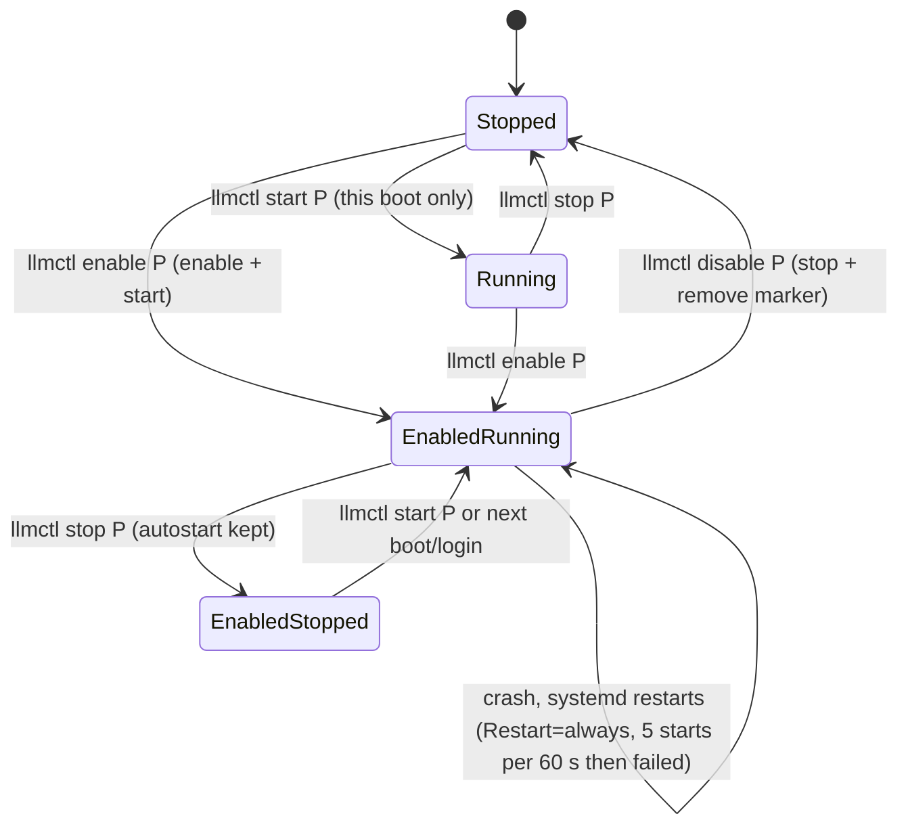
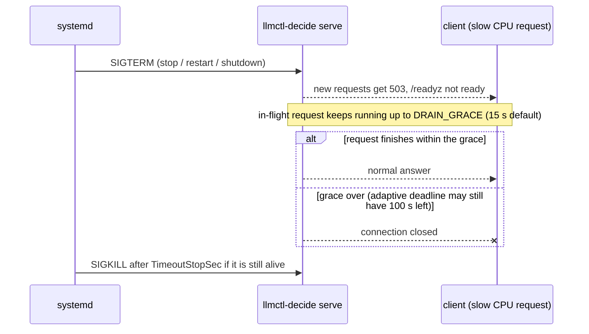

# Persistent services: engines and the decision gateway across logout and reboot

**Revision:** 1 - 2026-10-09. Applies to Linux (systemd `--user`), which is the verified platform. The macOS (launchd) path is covered by
tests and by reading the code only; it is **UNCONFIRMED on a real Mac** ([limitations](limitations.md)).

Contents: [What persists and what does not](#what-persists-and-what-does-not) | [Make the engines persistent](#make-the-engines-persistent) |
[Make the gateway persistent](#make-the-gateway-persistent) | [Linger](#linger) | [gateway.conf](#gatewayconf) | [Drop-ins](#drop-ins-resource-limits-and-overrides) |
[The CPU-adaptive timeout](#the-cpu-adaptive-timeout) | [Stopping: the 15 s drain grace](#stopping-the-15-s-drain-grace-g-161) |
[Verify, disable, uninstall](#verify-disable-uninstall) | [What was and was not verified](#what-was-and-was-not-verified)

## What persists and what does not

| Thing | Persistent across logout / reboot? | By what |
|---|---|---|
| An engine you started with `llmctl start <profile>` | no longer than the session | `start` runs the unit but does not enable it: after a reboot it stays down |
| An engine you `llmctl enable <profile>` | yes | `systemctl --user enable` (`WantedBy=default.target`) plus the `$LLMCTL_SERVICES_DIR/<profile>.enabled` marker |
| The gateway started with `llmctl decide serve` | no | a detached process with a pidfile |
| The gateway installed with `llmctl decide serve --enable` | yes | the user unit `llmctl-decide-gateway.service` |
| Logging out of the machine | only with **linger** | `loginctl enable-linger` (done by `llmctl install` and by `decide serve --enable`) |



The same states apply to the gateway unit, where `serve --enable` is `enable P` and `serve --disable` is `disable P`.

## Make the engines persistent

```bash
llmctl install                      # write the unit templates, daemon-reload, enable linger
llmctl enable decide-nli            # write the launch env file, enable autostart AND start now (admission-checked)
llmctl enable decide-kev-08b
llmctl status                       # a crash-looping unit shows failed (crash-loop)
```

* `enable` runs the same admission check as `start`: it refuses with exact numbers instead of overcommitting ([runbooks](runbooks.md#the-scheduler-refuses-a-start)).
* An enabled profile that you `llmctl stop` comes back at the next login/boot unless you `llmctl disable` it.
* Instance records (`$LLMCTL_SERVICES_DIR/<profile>.env`) survive reboots; the tmpfs reservations in `$LLMCTL_RUNTIME_DIR` do not and are reconciled on the next scheduler call.
* More than one instance of a decision profile: `llmctl decide scale <profile> <N>`; the instance keys are `<profile>`, `<profile>.2`, ... and each has its own unit instance, port and key file ([user manual](user-manual.md#decide-scale)).
* The unit templates carry `MemoryHigh`/`MemoryMax` at the host's probed RAM, `Restart=always`, `RestartSec=5`, `StartLimitBurst=5` (per 60 s) and strict hardening. Tighter per-unit limits are a drop-in (below).

## Make the gateway persistent

```bash
llmctl decide serve --enable [--now]    # install llmctl-decide-gateway.service, enable linger, enable and start it
llmctl decide serve --disable           # stop, disable, remove the unit file
```

Dry run (nothing written, nothing started; scratch state directory; the printed list is complete output):

```
$ LLMCTL_DRY_RUN=1 llmctl decide serve --enable --now
[dry-run] write <unit dir>/llmctl-decide-gateway.service
[dry-run] systemctl --user daemon-reload
[dry-run] loginctl enable-linger milosvasic
[dry-run] systemctl --user enable llmctl-decide-gateway.service
[dry-run] systemctl --user start llmctl-decide-gateway.service
```

Rules (from `lib/decide.sh` and `lib/service_linux.sh`, and `tests/test_decide_serve_enable.sh` with stubbed `systemctl`/`loginctl`):

* `--enable` and `--disable` accept **no other flag**: set the port and bind address in [gateway.conf](#gatewayconf). `--now` is optional (enable always starts the service) and only valid with `--enable`.
* Idempotent: a second `--enable` over an unchanged unit does nothing new; over a **changed** unit it runs `try-restart` so the new definition takes effect.
* It refuses while an installed **engine** unit is stale (`llmctl install` regenerates them). The gateway unit itself is excluded from that check.
* The unit (generated by `_decide_gateway_unit_body`; ports and paths come from your environment):

```ini
[Unit]
Description=llmctl decision gateway (HTTPS, key-protected; engines stay loopback-only)
After=network-online.target
Wants=network-online.target
StartLimitBurst=5
StartLimitIntervalSec=60

[Service]
Type=simple
Environment="LLMCTL_ROOT=..."  "LLMCTL_STATE_DIR=..."  "LLMCTL_LOG_DIR=..."  "LLMCTL_SERVICES_DIR=..."
Environment="LLMCTL_CONFIG_DIR=..."  "LLMCTL_DATA_DIR=..."  "LLMCTL_RUNTIME_DIR=..."  "LLMCTL_DECIDE_BIN=.../build/llmctl-decide"
EnvironmentFile=-<state dir>/decide/gateway.conf
ExecStart=/bin/bash ".../lib/svc_hook.sh" run-gateway
ExecStopPost=-/bin/bash ".../lib/svc_hook.sh" unregister gateway
Restart=always
RestartSec=5
MemoryHigh=<RAM>M
MemoryMax=<RAM>M
NoNewPrivileges=yes  ProtectSystem=full  UMask=0077  RestrictAddressFamilies=AF_UNIX AF_INET AF_INET6
RestrictSUIDSGID=yes  LockPersonality=yes  RestrictRealtime=yes  SystemCallArchitectures=native
StandardOutput=append:<log dir>/decide-gateway.log
StandardError=append:<log dir>/decide-gateway.log

[Install]
WantedBy=default.target
```

* No secret is in the unit. The access key lives in the installation `.env` (mode 0600), which the gateway reads itself ([tls-and-keys](tls-and-keys.md)); the unit does **not** set `LLMCTL_API_KEY`, so [key rotation](runbooks.md#rotate-the-access-key) works on the file.
* The wrapper `run-gateway` allocates the port (fixed 8095 unless `LLMCTL_PORT_STRATEGY=dynamic` or `LLMCTL_DECIDE_PORT`), publishes the gateway in the registry and finally `exec`s `llmctl-decide serve --foreground`; `ExecStopPost` withdraws the registry row.
* `--disable` removes the unit **file** only; a drop-in directory `llmctl-decide-gateway.service.d/` you created is left in place (nothing in `lib/service_linux.sh` removes a `.d` directory).

## Linger

Without linger, `systemd --user` and every user unit stop when your last session ends and do not start at boot. `llmctl install` and `decide serve --enable` run `loginctl enable-linger "$USER"` and print
`loginctl enable-linger failed; retry with: sudo loginctl enable-linger <user>` if the call is refused (some hosts require polkit/root for it).
Check: `loginctl show-user "$USER" -p Linger` prints `Linger=yes` (read on the development host). Without linger the services run only while you are logged in.

## gateway.conf

`<state dir>/decide/gateway.conf` (default `~/.local/state/llmctl/decide/gateway.conf`) is an optional systemd `EnvironmentFile`: `KEY=value` lines, no `export`, no quoting tricks, **no secrets**. Typical contents:

```
LLMCTL_DECIDE_BIND=127.0.0.1      # without it the gateway binds 0.0.0.0 (every interface)
LLMCTL_DECIDE_PORT=8095
LLMCTL_DECIDE_NATIVE=1            # needed to serve the native (kev/lev/julia/laya) profiles
LLMCTL_DECIDE_TIMEOUT=60          # explicit per-request deadline; beats the CPU-adaptive default
LLMCTL_DECIDE_DRAIN_GRACE=60      # see "Stopping" below
```

The file is read when the unit **starts**; after editing it: `systemctl --user restart llmctl-decide-gateway.service`. On the reference host (anton) the file held exactly the first and third lines
(`specs/009-jev-decision-models/evidence/persistent-services/anton-2026-10-09/units/gateway.conf`).
Binding: the Go binary's default is `0.0.0.0`; the service installs **no** loopback restriction by itself. A host that should serve only itself sets `LLMCTL_DECIDE_BIND=127.0.0.1`; a host that serves a LAN leaves it and reads [LAN exposure](lan-exposure.md).

## Drop-ins: resource limits and overrides

Do not edit the generated unit (`llmctl install` / `--enable` rewrite it). Put changes in `~/.config/systemd/user/<unit>.d/NN-name.conf` and run `systemctl --user daemon-reload` and a restart.
The development hosts used drop-ins to put tighter limits than the template's "limit = physical RAM":

```ini
# ~/.config/systemd/user/llmctl-decide-gateway.service.d/10-hostsafety.conf   (anton, 2026-10-09)
[Service]
MemoryHigh=1536M
MemoryMax=2G
TasksMax=512
```

Check the effective values: `systemctl --user show llmctl-decide-gateway.service -p MemoryHigh -p MemoryMax -p TasksMax`. Rationale and the host-level slice limits: [host-safety](host-safety.md).
With `LLMCTL_TENANT_ID` set the tenant slice is also applied as a drop-in `tenant-slice.conf` (`_svc_ensure_tenant_slice_dropin`), which is the only drop-in llmctl writes itself.

## The CPU-adaptive timeout

The Go gateway's per-request deadline is 8 s. When the launcher sees a **running or enabled** decision instance placed on CPU for a llama.cpp profile (`--n-gpu-layers 0`), and `LLMCTL_DECIDE_TIMEOUT` is **not** set anywhere
(environment, `gateway.conf`), it exports `LLMCTL_DECIDE_TIMEOUT=120` for the gateway. An explicit value always wins. The ONNX NLI encoder on CPU does not count. The effective value and its source are in the first lines of the gateway log:

```
  timeout: 8s per request (default; set LLMCTL_DECIDE_TIMEOUT to change)
  timeout: 120s per request (cpu-adaptive: CPU-placed decide-pro; an explicit LLMCTL_DECIDE_TIMEOUT overrides)
  timeout: 300s per request (env LLMCTL_DECIDE_TIMEOUT)
```

Read it with `tail -n 20 <log dir>/decide-gateway.log` (service) or in the terminal of `decide serve`. The value is decided at gateway start: **restart the gateway after enabling or disabling a CPU instance.**
Measurements, the one-global-value limitation and the client-side `llmctl decide ask` wait (30 s per attempt by default) are in [decide-gateway](decide-gateway.md#cpu-adaptive-default-launcher-side-g-156).

## Stopping: the 15 s drain grace (G-161)

On stop (`systemctl --user stop`, `restart`, reboot shutdown, `decide serve --stop`) the gateway **drains**: readiness flips, new requests get 503, in-flight requests may finish for at most
`LLMCTL_DECIDE_DRAIN_GRACE` (default **15 s**; the process then waits that plus 2 s), then the remaining connections are closed. The adaptive deadline can be 120 s, so:

* A CPU request that is still running when the 15 s are up is **cut off**: the client sees a closed connection, not a 503 and not an answer. This is documented, deliberate and **not fixed**: the launcher does not raise the grace, and no test drives a stop with a 20-120 s request in flight (gap G-161, open).
* Do not retry blindly: a retried request restarts the whole prefill on the engine.
* If stops must wait for slow requests, raise **both** limits, because systemd kills the unit after `TimeoutStopSec` regardless of the gateway's own grace (the systemd default on the development host is `DefaultTimeoutStopUSec=1min 30s`, read with `systemctl --user show -p DefaultTimeoutStopUSec`):

```ini
# gateway.conf
LLMCTL_DECIDE_DRAIN_GRACE=130
```

```ini
# ~/.config/systemd/user/llmctl-decide-gateway.service.d/20-stop.conf
[Service]
TimeoutStopSec=150
```

**UNCONFIRMED:** that `DRAIN_GRACE=130` plus `TimeoutStopSec=150` completes a 120 s request during a real stop was not exercised. The two values and the file locations follow the documented variable and systemd semantics only; try it with a deliberately slow request before relying on it.



## Verify, disable, uninstall

```bash
systemctl --user is-enabled llmctl-decide-gateway.service llmctl-onnx@decide-nli.service     # enabled
systemctl --user is-active  llmctl-decide-gateway.service                                    # active
loginctl show-user "$USER" -p Linger                                                         # Linger=yes
llmctl decide serve --status                                                                 # running pid N, up Ts (verified process, not just the pidfile)
llmctl decide models                                                                         # engines reachable through the gateway, status ready
journalctl --user -u 'llmctl*' --since -1h | tail                                            # unit logs; the gateway also writes decide-gateway.log
```

Remove: `llmctl decide serve --disable`, then `llmctl disable <profile>` for each engine. `systemctl --user reset-failed 'llmctl-*'` clears a failed state of **llmctl's** units only. Reboot survival was checked on the development host by a reconcile
test and a unit-level check, not by an actual reboot (rebooting that host is forbidden by policy): `specs/009-jev-decision-models/evidence/persistent-services/anton-2026-10-09/reboot-survival.txt`.

## Reaching a persistent gateway by `.local` name

A client built with `CGO_ENABLED=0` (static or cross-built) cannot resolve `*.local` mDNS names such as `https://nezha.local:8095`; it reports "the host name did not resolve". Use the gateway's IP address, an `/etc/hosts` entry, or build the client natively with cgo. Details and the reproduction: [lan-exposure](lan-exposure.md).

## What was and was not verified

* Verified live (anton, nezha; evidence under `specs/009-jev-decision-models/evidence/persistent-services/`): gateway and engine units enabled and active, `Linger=yes`, drop-in limits effective, `decide serve --enable` round trip, CPU-adaptive banner values.
* Verified in this documentation pass, on scratch directories only: the dry-run command list above, the generated unit text (rendered by `_decide_gateway_unit_body` with a scratch state directory), `decide scale` argument errors and its dry-run, `serve --status/--stop`.
* UNCONFIRMED: macOS launchd behaviour; a real reboot; the extended stop configuration above; behaviour with a firewall active (G-091).
