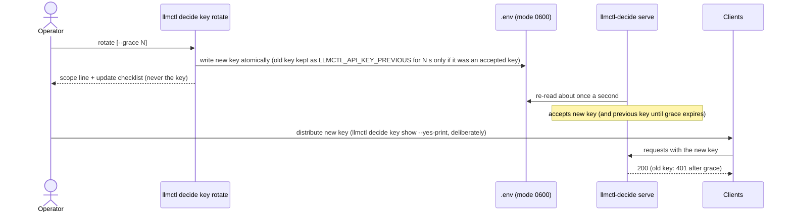
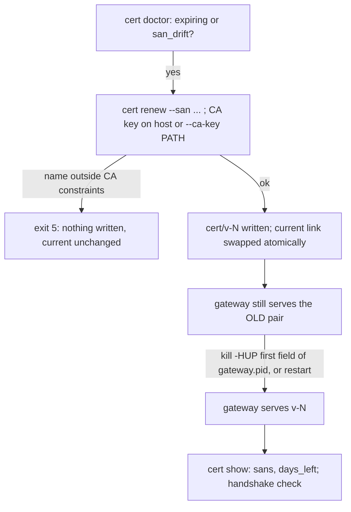
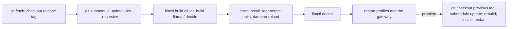

# Operations runbooks

**Revision:** 2 - 2026-10-09. Task-oriented procedures for the decision subsystem and the surrounding llmctl services. Every command here
exists in the code today; where behaviour is limited, the limit is stated. Linux (systemd `--user`) is the verified platform; macOS
(launchd) paths were checked statically only ([limitations](limitations.md)).

Contents: [Rotate the access key](#rotate-the-access-key) | [Persistent services](persistent-services.md) | [LAN exposure](lan-exposure.md) | [Renew / reload the certificate](#renew--reload-the-certificate) |
[Engine stuck or crash-looping](#engine-stuck-or-crash-looping) | [The scheduler refuses a start](#the-scheduler-refuses-a-start) | [Port conflicts](#port-conflicts) | [Registry reconcile](#registry-reconcile) |
[Vantage image prerequisite](#vantage-image-prerequisite) | [Release build and archive](#release-build-and-archive) |
[Stale unit files](#stale-unit-files) | [LD_LIBRARY_PATH shadowing](#ld_library_path-shadowing) | [Backup and restore](#backup-and-restore) | [Upgrade and rollback](#upgrade-and-rollback)

## Rotate the access key

Sequence (the diagram shows who holds which key; the gateway re-reads its key source about once a second, no restart is needed to *accept* a
new key):



Procedure:

1. `llmctl decide key doctor` - shows the **source** of the key (`env`, `file`, `none`), the file mode and whether the key is shadowed. Never the value.
2. `llmctl decide key rotate --grace 300` (omit `--grace` for immediate revocation).
3. Read the `scope:` line it prints. **Caveat: the key can come from two places.**
   * Key in the installation `.env` (the default; generated on first `decide serve`): rotation takes effect for the running gateway within about a second.
   * `LLMCTL_API_KEY` set in the **gateway's own environment** (a service unit, a supervisor): the file is not consulted, so rotating the file
     changes nothing for that gateway. Change or unset the variable where the gateway gets it and restart the gateway. The CLI cannot see
     another process's environment and says so rather than guessing. `--grace` is skipped in that case (the old file key was never accepted).
   The text `key rotate` prints says "restart the decision gateway so it loads the new key". For a gateway whose key comes from the `.env`
   that restart is **not required**: observed on a scratch gateway (below), the new key was accepted within 2 s of the rotation (the shortest wait tried) without a restart.
4. Update clients: `llmctl decide key show --yes-print` prints the key deliberately (to a terminal you control, not a log). For shell rc files
   use the reference form: `llmctl decide key export --file ~/.profile` adds a managed block that reads the key at login instead of storing a literal.
5. Verify: `curl --cacert "$LLMCTL_HOME/cert/ca/ca.crt" -H "Authorization: Bearer $LLMCTL_API_KEY" https://127.0.0.1:8095/v1/models` returns 200; the old key returns 401 after the grace.
6. A weak operator-supplied key already in `.env` makes the gateway refuse to start (exit 4, rule named). `key rotate` replaces it.
7. If the key source becomes unreadable or unsafe at run time, the gateway keeps the previous keys for 5 s, then refuses every request and counts
   `llmctl_decide_key_source_errors_total`. Fix the file (mode 0600, regular file, yours) and it recovers by itself.

The key for the **engines** (internal key files under `$LLMCTL_STATE_DIR/keys/`) is separate and rotates when an engine is restarted (`llmctl restart <profile>`).

## Renew / reload the certificate

```bash
llmctl decide cert doctor          # expiry (warns at 30 days), key/cert match, SAN drift vs this host's addresses, permissions
llmctl decide cert renew --san dns:gw.lan.local,ip:192.168.1.50     # re-issue the leaf; never touches the CA; swaps the 'current' link atomically
kill -HUP "$(awk '{print $1}' "$LLMCTL_STATE_DIR/decide/gateway.pid")"   # the gateway re-reads the pair on SIGHUP (key file checks run again)
```

Things that are easy to get wrong, each observed on a scratch installation (`LLMCTL_HOME` in a temp directory, a gateway on port 18995, the real
`build/llmctl-decide`; nothing on the live host was renewed):

* **`gateway.pid` has several fields** (`PID STARTTIME ...`), so `kill -HUP "$(cat gateway.pid)"` fails (`not a pid or valid job spec`). Take the first field as above.
* **A renewed certificate is not served until the gateway reloads it.** Observed: after `cert renew --san dns:lan.local,ip:10.9.8.7` a TLS handshake still presented the
  previous SANs; after `kill -HUP` it presented `DNS:lan.local ... IP Address:10.9.8.7`. Restarting the gateway has the same effect.
* **SANs are not sticky.** Each `renew` computes the SAN list from the host's own names/addresses plus `--san` / `LLMCTL_TLS_SAN` *of that run only*. Observed: v-2 was
  renewed with `--san dns:nezha.local,ip:192.168.1.50` and listed both; the next plain `cert renew --reuse-key` produced v-3 **without** them
  (`sans anton,localhost,127.0.0.1,::1,192.168.1.115`). Keep the list in one place (`export LLMCTL_TLS_SAN=...` in the shell you renew from, or a fixed command line in your own notes)
  and pass it every time; check `llmctl decide cert show` (`sans`) afterwards.
* **The CA constrains which names a leaf may carry.** A name outside the constraints is refused with exit 5; no new `v-N` directory is created and `current` is unchanged (observed: the next successful renewal was v-6 right after v-5). Observed:
  `--san dns:lan.example` -> `error: the new leaf does not verify against the CA (... DNS name "lan.example" is not permitted by any constraint) ... Remove .../cert/ca to start a new CA (clients must re-trust it), or set LLMCTL_CA_NAME_CONSTRAINTS=off before creating it.`
  Permitted by default: `localhost`, `*.local`, loopback, RFC 1918 ranges, ULA, CGNAT `100.64.0.0/10`, the host name, and whatever `--san` / `LLMCTL_TLS_SAN` listed **when the CA was created**
  (`openssl x509 -in cert/ca/ca.crt -noout -ext nameConstraints` shows the list). A public name added later needs a new CA; see [LAN exposure](lan-exposure.md).
* `--reuse-key` keeps the leaf private key (clients that pinned the leaf key are unaffected); without it the key changes with every renewal.
* When the CA key is **offline** (`ensure --offline-ca-key DEST`), `renew` refuses until you pass it: `error: the CA private key is offline (not in .../cert/ca); supply it with --ca-key PATH`; with `--ca-key PATH` it issues v-2 and the key stays off the host.

Flow (what talks to what; the gateway keeps serving the old pair until SIGHUP):



* Leaf lifetime and the CA lifetime are shown by `llmctl decide cert show` (`not_after`, `days_left`; 396 days for a new leaf on the scratch run). Renew the leaf long before expiry.
* Clients that pinned the CA keep working across leaf renewals. A **new CA** requires re-exporting `llmctl decide cert export DEST` to every client.
* `llmctl decide cert reload` is **not implemented** (listed in the contract as a design target); use SIGHUP or restart the gateway.
* Bring-your-own certificate: `LLMCTL_TLS_MODE=byo` with the pair in `cert/`; the key file must be a regular, owner-only file or the load is refused.

## Engine stuck or crash-looping

1. `llmctl status` - a crash-looping unit shows `failed (crash-loop)` with its last log line (systemd gives up after 5 starts in 60 s; launchd only widens the restart interval).
2. `llmctl logs <profile> 100`.
3. Common causes and what proves them:
   * **Port taken:** the log says address in use; see [Port conflicts](#port-conflicts).
   * **Does not fit:** `llmctl plan` / `llmctl start` print the exact numbers and an alternative.
   * **Shared-library shadowing:** `undefined symbol ggml_...`; see [LD_LIBRARY_PATH shadowing](#ld_library_path-shadowing).
   * **Large model still loading:** the unit's registry waiter allows `LLMCTL_REGISTER_WAIT` (default 600 s) before giving up on publishing it; give it time and re-check `llmctl-decide discover`.
4. After fixing the cause: `systemctl --user reset-failed 'llmctl-*'` (only llmctl's own units; do not reset foreign failed units) then `llmctl restart <profile>`.
5. The gateway never starts engines: a profile with no ready engine answers `503 not_ready` until the engine is up.

## The scheduler refuses a start

On a RAM-constrained host `llmctl start <profile>` (and `enable`, `auto`) can refuse, and that is the shipped behaviour, not a malfunction: the scheduler never overcommits. The refusal carries numbers, for example (a real refusal recorded on the development host):

```
needs 3896 MiB RAM, but only 1976 MiB remain
```

1. `llmctl plan` shows the budgets (RAM: available minus 4 GiB headroom; VRAM: 85% of what is free *now*) and each profile's estimate. The budget follows live `MemAvailable`: the same profile can be refused one minute and admitted the next after another program frees memory.
2. Free memory (stop what you started: `llmctl stop <profile>`, or close the other program), or pick a smaller profile (`llmctl plan` marks what fits). Do **not** work around the refusal by launching the engine by hand: that bypasses the budget the other services rely on.
3. A GPU placement still reserves a fixed 2048 MiB of host RAM; if that alone does not fit, the refusal says so even when VRAM is plentiful.
4. Native decision profiles: the estimate for `decide-kev-4b`, `decide-kev-9b` and `decide-lev` has no measured working-set term and is very likely too low, so an admission for them is weaker evidence than for `decide-julia`, `decide-laya` and `decide-kev-08b` ([hardware-tiers](hardware-tiers.md), "How the planner estimates memory").
5. "CPU mode" is not VRAM-free on a CUDA build of the engine. The planner books 0 VRAM for a CPU placement, but the engine still offloads large-batch host operations to the GPU: measured on the development host, 0.1-0.2 GiB for the two small encoder models and about 2.3 GiB for `decide-kev-08b` (a 775 MiB model). If the GPU is shared with other services, leave room for this, or prefer a GPU placement. Switching that offload off removes the VRAM use but made `decide-kev-08b` about 15 times slower with a larger RAM footprint, so it is not a recommended workaround
   ([live evidence](../specs/009-jev-decision-models/evidence/live/NATIVE-REPORT.md), section 4.3).

## Port conflicts

* Fixed strategy (default): a taken port fails loudly and the message names `LLMCTL_PORT_<PROFILE>`; the full port list, the variable's naming rule and the fixed/dynamic strategies are on the [ports](ports.md) page. Documented ports commonly taken by other software on developer machines: 8080, 8082, 8087, 8099 (that is why `decide-max` moved to 8097).
* Override one profile: `LLMCTL_PORT_FAST=18080 llmctl enable fast`; `auto` lets that profile alone pick a free port.
* Dynamic ports for everything: `LLMCTL_PORT_STRATEGY=dynamic` (per-user ranges; see [registry-discovery](registry-discovery.md)). The gateway's own port: `LLMCTL_DECIDE_PORT` or `LLMCTL_PORT_GATEWAY`.
* See who holds a port: `ss -ltnp 'sport = :8095'` (shows only your own processes' names).
* `llmctl-decide port list` shows the allocator's holds; `port release NAME` frees one (idempotent).

## Registry reconcile

The gateway runs an in-process reconciler (every `LLMCTL_DECIDE_RECONCILE_INTERVAL`, default 5 s; entries unhealthy for `LLMCTL_DECIDE_RECONCILE_GRACE`, default 30 s, are removed). By hand:

```bash
build/llmctl-decide registry list --json
build/llmctl-decide registry reconcile --strict --json    # exit 1 when an https entry cannot be verified or the registry was corrupt
build/llmctl-decide registry diff --live decide-gateway=<pid>   # rows vs the live set
build/llmctl-decide registry ack-corrupt                  # acknowledge a "registry was corrupt" note after you have looked at it
```

* https entries are verified against the CA named by the entry's `ca_file` label, else `LLMCTL_CACERT`, else `$LLMCTL_HOME/cert/ca/ca.crt`. With no CA they are reported `unknown` and kept, never removed unless `--prune-unknown-after D` is given.
* Allocated-but-unbound port holds are kept `--port-grace` (default 600 s, at least `LLMCTL_REGISTER_WAIT`), so a slow-loading engine does not lose its port.
* A corrupt registry file is moved aside once; the note stays visible until `ack-corrupt`.

## Vantage image prerequisite

`llmctl-decide vantage` (a second network location for exposure tests) boots a tiny **rootless** container through the Containers submodule with `--pull=never`:
a usable **local** image must already exist (candidate list smallest-first; `LLMCTL_VANTAGE_IMAGE` takes precedence), and rootless podman must work. Without it
the command exits 3 with the reason on stderr. Pull an image yourself (for example `podman pull docker.io/library/alpine`) then `vantage up`; `vantage down` removes the
container and state. The vantage proves a **different source address and network namespace** (slirp4netns), not a different ISP, firewall or NAT.
`llmctl decide vantage ...` forwards to the binary (the first candidate's front end did not; an older tree can still be driven as `build/llmctl-decide vantage ...`).

## Release build and archive

* `make archive` runs `scripts/release/build_archive.sh`, which **refuses a dirty tree** (only committed content is released) unless `--allow-dirty`; the manifest inside the archive records `dirty=true/false`.
* It refuses to ship a submodule that yields zero files (not initialised), a `.git` with history paths containing control characters, and anything the secret deny-list or the independent post-scan (`scripts/release/scan_archive.py`) rejects. Exemptions are exact paths in `scripts/release/public_allowlist.txt`.
* Procedure and per-forge retry: [release-process](release-process.md). Preflight: `scripts/release/preflight_submodules.sh`.

## Stale unit files

`llmctl doctor` warns `stale service unit(s): ...` when an installed unit lacks a directive the current generator emits (state-dir environment, hardening, quoting of paths with spaces).
Fix: `llmctl install` regenerates them, then `systemctl --user daemon-reload` is done by llmctl; restart the affected profile. Extra directives you added and different values are not treated as stale.

## LD_LIBRARY_PATH shadowing

Symptom: `llama-server` fails with `undefined symbol ggml_flash_attn_ext_set_n_kv_max` (or another `ggml_` symbol) after the engine pin moved from b10969 to b11379: a user shell exported
`LD_LIBRARY_PATH` pointing at a system `libggml`, which wins over the engine's own libraries (the new build is shared-library with RPATH into `build/bin`).
Check: `echo "$LD_LIBRARY_PATH"`; `ldd submodules/llama.cpp/build/bin/llama-server | grep ggml`. Fixed for services llmctl starts (G-129): the generated systemd units write the engine's own directory into `LD_LIBRARY_PATH` (confirmed live: the running engines mapped `build/bin/libggml.so.0.25.3`),
and the launch wrapper `hk_run_engine` (`lib/svc_hook.sh`; the launchd path, covered by tests and **statically only on macOS**) now **prepends** the engine's directory when it ships `libggml*`, keeping any CUDA directories the caller listed behind it.
A **manual** launch of `llama-server` from a shell with the variable set can still hit it - unset it (`env -u LD_LIBRARY_PATH ...`) or prepend the engine's directory yourself; `llmctl doctor` does not check this for manual launches.
A copied `llama-server` binary does not run without its sibling libraries (G-117).

## Backup and restore

What to back up (all under your user, nothing is system-wide):

| What | Where | Note |
|---|---|---|
| CA + leaf + keys | `$LLMCTL_HOME/cert/` (default `~/llmctl/cert`) | directories 0700, private keys and `.lock` 0600, certificates/`meta.json` 0644. Without the CA key (`cert/ca/ca.key`) you cannot issue new leaves under the same CA; clients would need a new CA. `llmctl decide cert ensure --offline-ca-key DEST` exports the CA key to offline media (no overwrite, no symlink follow) |
| Access key | the installation `.env` (`llmctl decide key path`) | mode 0600; also holds `LLMCTL_API_KEY_PREVIOUS` and `LLMCTL_API_KEY_PREVIOUS_EXPIRES` during a grace |
| Service tunables | `$LLMCTL_STATE_DIR/decide/gateway.conf` | bind address, port, `LLMCTL_DECIDE_TIMEOUT`, `LLMCTL_DECIDE_NATIVE` ... no secret belongs here |
| Request-log key | `$LLMCTL_STATE_DIR/decide/log.key` | only needed to keep state hashes comparable across restores |
| Models | `$LLMCTL_MODELS_DIR` | re-downloadable and sha256-verified (`llmctl models verify <p>`) |

Layout that a backup of `cert/` captures (scratch installation after `cert ensure`; `find -printf '%m %y %p'`):

```
700 d cert
700 d cert/ca            644 f cert/ca/ca.crt     600 f cert/ca/ca.key
777 l cert/current -> v-1
700 d cert/v-1           644 f chain.pem  644 f leaf.crt  600 f leaf.key  644 f meta.json
600 f cert/.lock
```

Procedure, exercised end to end in a scratch `LLMCTL_HOME` (temp directory, real `build/llmctl-decide`; the live host's certificates were not touched):

```bash
# backup (umask 077 keeps the archive private; it contains the CA key and the leaf key)
( umask 077; tar -C "$LLMCTL_HOME" -czf cert-backup.tgz cert )
tar -tzvf cert-backup.tgz | awk '{print $1, $6}'
#   drwx------ cert/   lrwxrwxrwx cert/current   drwx------ cert/v-1/   -rw------- cert/v-1/leaf.key   -rw------- cert/ca/ca.key ...

# restore into an empty home (tar keeps the modes)
mkdir -p "$NEW_HOME" && tar -C "$NEW_HOME" -xzf cert-backup.tgz
LLMCTL_HOME="$NEW_HOME" llmctl decide cert doctor
#   OK crypto / key_matches_cert / expiry (valid for 396 more days) / chain / san_drift / permissions (directory 0700, keys 0600)
LLMCTL_HOME="$NEW_HOME" llmctl decide cert show | grep -E '^(version|ca_sha256|sans)'
#   version 1; ca_sha256 identical to the original; sans identical
```

* Restore rules: put the files back with the same modes. If you restore through a tool that loosens them, `cert doctor` says so and exits 5:
  `FAIL  permissions  .../cert/v-1/leaf.key is mode 644 (want 600 or stricter)`; the gateway also refuses to load such a key. Fix with `chmod 600` and re-run `cert doctor`.
* The access key: copy `.env` back with mode 0600; then `llmctl decide key doctor` must say `env file mode: 600 (safe)`. A restored backup that still holds a key you rotated away from re-arms the old key: rotate again after restoring an old backup.
* Clients keep working after a restore only if the **CA** is the same (same `ca_sha256`). If you restored the CA but lost the leaf, `cert renew` issues a new leaf under it. If you lost the CA key, run `cert ensure` in a new home: it creates a **new CA**, and every client needs `cert export` again.
* The public CA certificate alone (`llmctl decide cert export DEST`, mode 0644) is safe to hand around; it is what clients need. Never put `cert/` or `.env` into a git working tree that git does not ignore (the placement guard refuses to create secrets there; a backup you copy there yourself is not guarded).
* Offline CA key: `LLMCTL_HOME=... llmctl decide cert ensure --offline-ca-key /media/usb/ca.key` on a **new** installation created a 0600 file and `show` then reports `ca_key_on_host false`; on an installation that already exists the same flag printed `created=false` and exported **nothing** (observed: no file appeared). To take the key of an existing CA offline, move `cert/ca/ca.key` yourself after a backup, and pass it back with `renew --ca-key PATH` when needed.

## Upgrade and rollback

What changes with an upgrade and what does not: certificates (`cert/`), the access key (`.env`), `gateway.conf`, models and the registry are **not** rewritten by it; unit files are regenerated by `llmctl install`; the engines are rebuilt from the pinned submodules.



Upgrade:

1. `git fetch --tags`, `git checkout <release tag>`, `git submodule update --init --recursive`. The **engine pin is the submodule commit recorded by the tag**: `git submodule status --cached submodules/llama.cpp` prints it. In this tree 3.0.2 recorded `391fac16460f15233a7740550d858ac96df3419d` (llama.cpp `b10969`) and 3.1.0 records `1537a0a8b2f8711d840878b0a0677ab2213c882c` (`b11379`; `git -C submodules/llama.cpp tag --points-at 1537a0a8b` prints `b11379`).
2. `llmctl build all` (needs Go >= 1.25 for `decide`, PyPI access for the hash-locked `onnx` venv, OpenSSL headers so the engine is built with HTTPS). A build is "successful" only if `llama-server --version` runs. Rebuild a single engine with `llmctl build llama|colibri|onnx|decide`.
3. `llmctl install` (refresh units; `llmctl doctor` warns `stale service unit(s)` when you skip it; `llmctl decide serve --enable` refuses while an engine unit is stale), `llmctl doctor`, then restart: `llmctl restart <profile>` for each engine and `systemctl --user restart llmctl-decide-gateway.service` (or `llmctl decide serve --stop` and start) for the gateway. `llmctl version` prints the version (`llmctl 3.1.0`).
4. 3.1.0 refuses weak access keys at start (exit 4, rule named); a weak key stored before the upgrade must be rotated (`llmctl decide key rotate`).
5. **Already-enabled ONNX profiles (for example `decide-nli`) keep `LLMCTL_REG_HEALTH=/health` in their instance env record** (`$LLMCTL_STATE_DIR/services/<instance>.env`) until it is rewritten; the encoder answers `/readyz`, not `/health`, so such an instance can stay unregistered or be dropped by the registry reconciler. After upgrading, re-run `llmctl enable <profile>` (or `llmctl start` / `llmctl decide scale`, which also rewrite the record), then check `llmctl decide models`.

Rollback:

1. `git checkout <previous tag>` and `git submodule update --init --recursive` (this moves `submodules/llama.cpp` back to the previous commit; a plain `git checkout` of the superproject does **not** move submodules by itself).
2. `llmctl build all`, `llmctl install`, `llmctl doctor`, restart profiles and gateway as above.
3. Certificates, keys and models are unchanged by either direction. A unit file generated by the newer version is replaced by `llmctl install`; drop-ins you added under `<unit>.d/` stay.
4. Roll back only the engine pin: `git -C submodules/llama.cpp checkout <old commit>`, `llmctl build llama`, `llmctl restart <profile>`; then `git status` shows the submodule as modified: either commit that pin deliberately or `git submodule update` to return to the recorded one.
5. The v3.0.2 tag predates the decision gateway (3.1.0 feature set); rolling back to it removes `llmctl decide` entirely: stop and disable the gateway first (`llmctl decide serve --disable`) so no unit is left pointing at a missing binary.

**UNCONFIRMED:** the upgrade and rollback sequences above were assembled from the commands' documented behaviour and the tag/submodule facts printed here; a full tag-to-tag upgrade and rollback was not executed on any host in this pass (it would rebuild the engines).
