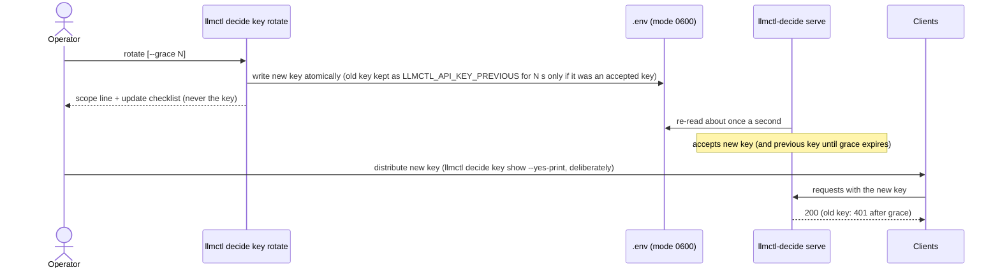

# Operations runbooks

**Revision:** 1 - 2026-10-08. Task-oriented procedures for the decision subsystem and the surrounding llmctl services. Every command here
exists in the code today; where behaviour is limited, the limit is stated. Linux (systemd `--user`) is the verified platform; macOS
(launchd) paths were checked statically only ([limitations](limitations.md)).

Contents: [Rotate the access key](#rotate-the-access-key) | [Renew / reload the certificate](#renew--reload-the-certificate) |
[Engine stuck or crash-looping](#engine-stuck-or-crash-looping) | [The scheduler refuses a start](#the-scheduler-refuses-a-start) | [Port conflicts](#port-conflicts) | [Registry reconcile](#registry-reconcile) |
[Vantage image prerequisite](#vantage-image-prerequisite) | [Release build and archive](#release-build-and-archive) |
[Stale unit files](#stale-unit-files) | [LD_LIBRARY_PATH shadowing](#ld_library_path-shadowing) | [Backup and restore](#backup-and-restore) | [Upgrade and rollback](#upgrade-and-rollback)

## Rotate the access key

Sequence (the diagram shows who holds which key; the gateway re-reads its key source about once a second, no restart is needed to *accept* a
new key):



Procedure:

1. `llmctl decide key doctor` - shows the **source** of the key (`env`, `file`, `none`), the file mode and whether the key is shadowed. Never the value.
2. `llmctl decide key rotate --grace 300` (omit `--grace` for immediate revocation).
3. Read the `scope:` line it prints. **Caveat: the key can come from two places.**
   * Key in the installation `.env` (the default; generated on first `decide serve`): rotation takes effect for the running gateway within about a second.
   * `LLMCTL_API_KEY` set in the **gateway's own environment** (a service unit, a supervisor): the file is not consulted, so rotating the file
     changes nothing for that gateway. Change or unset the variable where the gateway gets it and restart the gateway. The CLI cannot see
     another process's environment and says so rather than guessing. `--grace` is skipped in that case (the old file key was never accepted).
4. Update clients: `llmctl decide key show --yes-print` prints the key deliberately (to a terminal you control, not a log). For shell rc files
   use the reference form: `llmctl decide key export --file ~/.profile` adds a managed block that reads the key at login instead of storing a literal.
5. Verify: `curl --cacert "$LLMCTL_HOME/cert/ca/ca.crt" -H "Authorization: Bearer $LLMCTL_API_KEY" https://127.0.0.1:8095/v1/models` returns 200; the old key returns 401 after the grace.
6. A weak operator-supplied key already in `.env` makes the gateway refuse to start (exit 4, rule named). `key rotate` replaces it.
7. If the key source becomes unreadable or unsafe at run time, the gateway keeps the previous keys for 5 s, then refuses every request and counts
   `llmctl_decide_key_source_errors_total`. Fix the file (mode 0600, regular file, yours) and it recovers by itself.

The key for the **engines** (internal key files under `$LLMCTL_STATE_DIR/keys/`) is separate and rotates when an engine is restarted (`llmctl restart <profile>`).

## Renew / reload the certificate

```bash
llmctl decide cert doctor          # expiry (warns at 30 days), key/cert match, SAN drift vs this host's addresses, permissions
llmctl decide cert renew           # re-issue the leaf (new SANs picked up); never touches the CA; swaps the 'current' link atomically
kill -HUP "$(cat "$LLMCTL_STATE_DIR/decide/gateway.pid")"     # the gateway re-reads the pair on SIGHUP (key file checks run again)
```

* Leaf lifetime and the CA lifetime are shown by `llmctl decide cert show` (`not_after`, `days_left`). Renew the leaf long before expiry.
* A changed IP/host name (DHCP, new interface) shows up as `san_drift` in `cert doctor`; renew with `--san dns:NAME,ip:ADDR` (or `LLMCTL_TLS_SAN`) to add names.
* Clients that pinned the CA keep working across leaf renewals. A **new CA** requires re-exporting `llmctl decide cert export DEST` to every client.
* `llmctl decide cert reload` is **not implemented** (listed in the contract as a design target); use SIGHUP or restart the gateway.
* Bring-your-own certificate: `LLMCTL_TLS_MODE=byo` with the pair in `cert/`; the key file must be a regular, owner-only file or the load is refused.

## Engine stuck or crash-looping

1. `llmctl status` - a crash-looping unit shows `failed (crash-loop)` with its last log line (systemd gives up after 5 starts in 60 s; launchd only widens the restart interval).
2. `llmctl logs <profile> 100`.
3. Common causes and what proves them:
   * **Port taken:** the log says address in use; see [Port conflicts](#port-conflicts).
   * **Does not fit:** `llmctl plan` / `llmctl start` print the exact numbers and an alternative.
   * **Shared-library shadowing:** `undefined symbol ggml_...`; see [LD_LIBRARY_PATH shadowing](#ld_library_path-shadowing).
   * **Large model still loading:** the unit's registry waiter allows `LLMCTL_REGISTER_WAIT` (default 600 s) before giving up on publishing it; give it time and re-check `llmctl-decide discover`.
4. After fixing the cause: `systemctl --user reset-failed 'llmctl-*'` (only llmctl's own units; do not reset foreign failed units) then `llmctl restart <profile>`.
5. The gateway never starts engines: a profile with no ready engine answers `503 not_ready` until the engine is up.

## The scheduler refuses a start

On a RAM-constrained host `llmctl start <profile>` (and `enable`, `auto`) can refuse, and that is the shipped behaviour, not a malfunction: the scheduler never overcommits. The refusal carries numbers, for example (a real refusal recorded on the development host):

```
needs 3896 MiB RAM, but only 1976 MiB remain
```

1. `llmctl plan` shows the budgets (RAM: available minus 4 GiB headroom; VRAM: 85% of what is free *now*) and each profile's estimate. The budget follows live `MemAvailable`: the same profile can be refused one minute and admitted the next after another program frees memory.
2. Free memory (stop what you started: `llmctl stop <profile>`, or close the other program), or pick a smaller profile (`llmctl plan` marks what fits). Do **not** work around the refusal by launching the engine by hand: that bypasses the budget the other services rely on.
3. A GPU placement still reserves a fixed 2048 MiB of host RAM; if that alone does not fit, the refusal says so even when VRAM is plentiful.
4. Native decision profiles: the estimate for `decide-kev-4b`, `decide-kev-9b` and `decide-lev` has no measured working-set term and is very likely too low, so an admission for them is weaker evidence than for `decide-julia`, `decide-laya` and `decide-kev-08b` ([hardware-tiers](hardware-tiers.md), "How the planner estimates memory").
5. "CPU mode" is not VRAM-free on a CUDA build of the engine. The planner books 0 VRAM for a CPU placement, but the engine still offloads large-batch host operations to the GPU: measured on the development host, 0.1-0.2 GiB for the two small encoder models and about 2.3 GiB for `decide-kev-08b` (a 775 MiB model). If the GPU is shared with other services, leave room for this, or prefer a GPU placement. Switching that offload off removes the VRAM use but made `decide-kev-08b` about 15 times slower with a larger RAM footprint, so it is not a recommended workaround
   ([live evidence](../specs/009-jev-decision-models/evidence/live/NATIVE-REPORT.md), section 4.3).

## Port conflicts

* Fixed strategy (default): a taken port fails loudly and the message names `LLMCTL_PORT_<PROFILE>`; the full port list, the variable's naming rule and the fixed/dynamic strategies are on the [ports](ports.md) page. Documented ports commonly taken by other software on developer machines: 8080, 8082, 8087, 8099 (that is why `decide-max` moved to 8097).
* Override one profile: `LLMCTL_PORT_FAST=18080 llmctl enable fast`; `auto` lets that profile alone pick a free port.
* Dynamic ports for everything: `LLMCTL_PORT_STRATEGY=dynamic` (per-user ranges; see [registry-discovery](registry-discovery.md)). The gateway's own port: `LLMCTL_DECIDE_PORT` or `LLMCTL_PORT_GATEWAY`.
* See who holds a port: `ss -ltnp 'sport = :8095'` (shows only your own processes' names).
* `llmctl-decide port list` shows the allocator's holds; `port release NAME` frees one (idempotent).

## Registry reconcile

The gateway runs an in-process reconciler (every `LLMCTL_DECIDE_RECONCILE_INTERVAL`, default 5 s; entries unhealthy for `LLMCTL_DECIDE_RECONCILE_GRACE`, default 30 s, are removed). By hand:

```bash
build/llmctl-decide registry list --json
build/llmctl-decide registry reconcile --strict --json    # exit 1 when an https entry cannot be verified or the registry was corrupt
build/llmctl-decide registry diff --live decide-gateway=<pid>   # rows vs the live set
build/llmctl-decide registry ack-corrupt                  # acknowledge a "registry was corrupt" note after you have looked at it
```

* https entries are verified against the CA named by the entry's `ca_file` label, else `LLMCTL_CACERT`, else `$LLMCTL_HOME/cert/ca/ca.crt`. With no CA they are reported `unknown` and kept, never removed unless `--prune-unknown-after D` is given.
* Allocated-but-unbound port holds are kept `--port-grace` (default 600 s, at least `LLMCTL_REGISTER_WAIT`), so a slow-loading engine does not lose its port.
* A corrupt registry file is moved aside once; the note stays visible until `ack-corrupt`.

## Vantage image prerequisite

`llmctl-decide vantage` (a second network location for exposure tests) boots a tiny **rootless** container through the Containers submodule with `--pull=never`:
a usable **local** image must already exist (candidate list smallest-first; `LLMCTL_VANTAGE_IMAGE` takes precedence), and rootless podman must work. Without it
the command exits 3 with the reason on stderr. Pull an image yourself (for example `podman pull docker.io/library/alpine`) then `vantage up`; `vantage down` removes the
container and state. The vantage proves a **different source address and network namespace** (slirp4netns), not a different ISP, firewall or NAT.
`llmctl decide vantage ...` forwards to the binary (the first candidate's front end did not; an older tree can still be driven as `build/llmctl-decide vantage ...`).

## Release build and archive

* `make archive` runs `scripts/release/build_archive.sh`, which **refuses a dirty tree** (only committed content is released) unless `--allow-dirty`; the manifest inside the archive records `dirty=true/false`.
* It refuses to ship a submodule that yields zero files (not initialised), a `.git` with history paths containing control characters, and anything the secret deny-list or the independent post-scan (`scripts/release/scan_archive.py`) rejects. Exemptions are exact paths in `scripts/release/public_allowlist.txt`.
* Procedure and per-forge retry: [release-process](release-process.md). Preflight: `scripts/release/preflight_submodules.sh`.

## Stale unit files

`llmctl doctor` warns `stale service unit(s): ...` when an installed unit lacks a directive the current generator emits (state-dir environment, hardening, quoting of paths with spaces).
Fix: `llmctl install` regenerates them, then `systemctl --user daemon-reload` is done by llmctl; restart the affected profile. Extra directives you added and different values are not treated as stale.

## LD_LIBRARY_PATH shadowing

Symptom: `llama-server` fails with `undefined symbol ggml_flash_attn_ext_set_n_kv_max` (or another `ggml_` symbol) after the engine pin moved from b10969 to b11379: a user shell exported
`LD_LIBRARY_PATH` pointing at a system `libggml`, which wins over the engine's own libraries (the new build is shared-library with RPATH into `build/bin`).
Check: `echo "$LD_LIBRARY_PATH"`; `ldd submodules/llama.cpp/build/bin/llama-server | grep ggml`. Fixed for services llmctl starts (G-129): the generated systemd units write the engine's own directory into `LD_LIBRARY_PATH` (confirmed live: the running engines mapped `build/bin/libggml.so.0.25.3`),
and the launch wrapper `hk_run_engine` (`lib/svc_hook.sh`; the launchd path, covered by tests and **statically only on macOS**) now **prepends** the engine's directory when it ships `libggml*`, keeping any CUDA directories the caller listed behind it.
A **manual** launch of `llama-server` from a shell with the variable set can still hit it - unset it (`env -u LD_LIBRARY_PATH ...`) or prepend the engine's directory yourself; `llmctl doctor` does not check this for manual launches.
A copied `llama-server` binary does not run without its sibling libraries (G-117).

## Backup and restore

What to back up (all under your user, nothing is system-wide):

| What | Where | Note |
|---|---|---|
| CA + leaf + keys | `$LLMCTL_HOME/cert/` (default `~/llmctl/cert`) | mode 0700/0600. Without the CA key you cannot issue new leaves under the same CA; clients would need a new CA. `llmctl decide cert ensure --offline-ca-key DEST` exports the CA key to offline media (no overwrite, no symlink follow) |
| Access key | the installation `.env` (`llmctl decide key path`) | mode 0600; also holds `LLMCTL_API_KEY_PREVIOUS` during a grace |
| Request-log key | `$LLMCTL_STATE_DIR/decide/log.key` | only needed to keep state hashes comparable across restores |
| Models | `$LLMCTL_MODELS_DIR` | re-downloadable and sha256-verified (`llmctl models verify <p>`) |

Restore: put the files back with the same modes (the loader refuses group/other-readable private keys), then `llmctl decide cert doctor` and `llmctl decide key doctor`.
Never back them up into a git working tree that git does not ignore (the placement guard refuses to create secrets there).

## Upgrade and rollback

1. `git fetch`, check out the release tag, `git submodule update --init --recursive`.
2. `llmctl build all` (needs Go >= 1.25 for `decide`, PyPI access for the hash-locked `onnx` venv, OpenSSL headers so the engine is built with HTTPS). Engine pin moved b10969 to b11379 in 3.1.0.
3. `llmctl install` (refresh units), `llmctl doctor`, restart profiles and the gateway.
4. Rollback: check out the previous tag, rebuild, `llmctl install`. Certificates, keys and models are not changed by an upgrade. Note 3.1.0 refuses weak keys at start; a weak key stored before the upgrade must be rotated.
