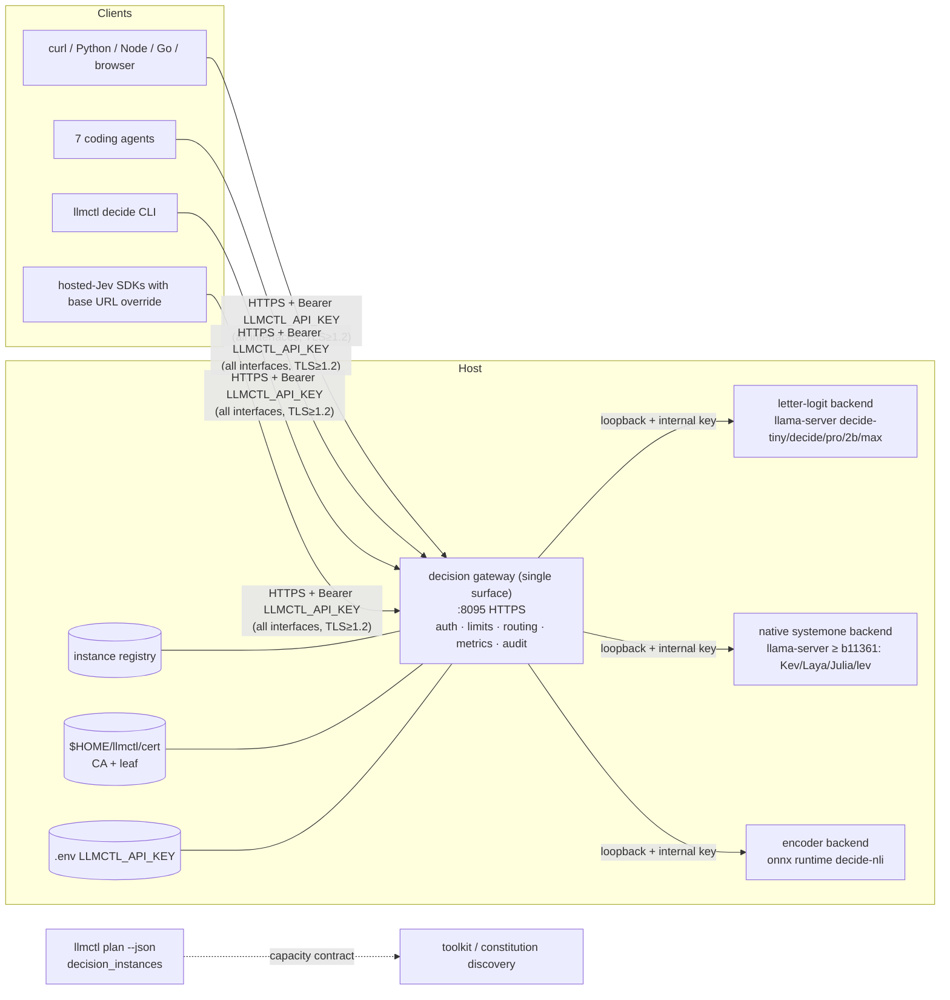

# Implementation Plan: Jev-Class Decision Models in llmctl

**Branch**: `009-jev-decision-models` (spec directory; no git branch created) | **Date**: 2026-10-07 | **Spec**: [spec.md](spec.md)
**Input**: Feature specification `specs/009-jev-decision-models/spec.md` (91 requirements, 15 success criteria, 9 stories, 5 operator clarifications, planning amendments logged in the spec)

## Summary

Bring open Jev-class "decision models" into llmctl so an operator can download, verify, run and expose them on this host or the network exactly like the existing chat profiles, behind **one HTTPS-only, key-protected gateway** that speaks the hosted Jev wire format (`POST /v1/systemone`). The second team's candidate (six profiles, a `decide` command, a gateway, an encoder runtime) is **merged onto current HEAD `a9ebefe` by a mechanical three-way merge (measured: 0 text conflicts in 24 of 26 files; the 2 conflicts are stale QA artefacts where HEAD wins)** and then **hardened and re-verified**, because the research found it is stand-in-tested only and carries 31 defects from the first review plus 29 more from file-level review (several reproduced).

Approach in one paragraph: port the candidate unchanged first (faithful, reviewable image); write failing reproduction tests for every finding on that unmodified code (FR-040); then replace the two ad-hoc HTTP servers with **one shared, hardened server layer** (TLS per connection, bounded slots, absolute deadlines, key auth, typed errors, correlation IDs) and Go packages for keys, certificates, contract validation and readout math, keeping bash as the thin CLI. *(Implementation, 2026-10-08: the layer is Go + Gin in the `llmctl-decide` binary - `internal/server`, `internal/gateway`, `internal/keyring`, `internal/certs`, `internal/contract`, `internal/readout`. The first draft of this plan said "stdlib-only Python"; the operator's Go + Gin rule of 2026-10-07 superseded it, see the Structure Decision below.)* A **CA + leaf certificate** pair (created under `$HOME/llmctl/cert`) and a **generated `LLMCTL_API_KEY`** (env → `.env` → generate-on-first-start) protect the single network-facing surface; every engine and runtime behind it is loopback-only with a per-start internal key. Real-model evidence (downloads against huggingface.co, real `llama-server`, real `onnxruntime` in a hash-locked venv) replaces the stand-ins as the proof; stand-ins stay only in unit tests. A gated engine advance (llama.cpp b10969 → ≥ b11361) unlocks the engine's own native `/v1/systemone` for Kev, Laya, Julia-1 and lev; if the gate fails those stay "pending engine advance". Release 3.1.0 follows after live tests on this host, a client-by-call HTTPS matrix, the 7 agents, an automated documentation audit and a verified two-forge publication with assets and checksums.

## Technical Context

**Language/Version**: Bash for the CLI, scheduler, services, tests (existing portability level; macOS `/bin/bash` 3.2 compatibility of **new** code verified by test, not assumed). **Go ≥ 1.25 with Gin** for the decision gateway, client, certificate/key tooling, contract and readout logic (one binary, `llmctl-decide`; *historical: the first draft planned Python ≥ 3.9 stdlib-only for these, superseded 2026-10-07*). Python remains only for the encoder runtime and the existing bash libraries' JSON helpers. The encoder runtime needs Python **≥ 3.12** in its own venv (locked `numpy 2.5.3` requires it) – a doctor check reports an interpreter that is too old.
**Primary Dependencies**: `llama.cpp` submodule (pin currently build **b10969** (`391fac16`), reported by the binary as `0.4.1-dev`, *not* "v0.4.0"); TLS, certificates and keys use Go's standard library (`crypto/x509`, `crypto/ecdsa`; no `openssl` CLI needed by the gateway - *historical: the first draft named the `openssl` CLI and `python3`*); `python3` stays for the existing bash libraries and the encoder runtime. Encoder runtime only: `onnxruntime 1.30.0`, `numpy 2.5.3`, `sentencepiece 0.2.2`, `tokenizers 0.23.2` plus their transitive dependencies, all hash-locked, binary wheels only (verified to exist for cp314 on Linux x86_64 and macOS arm64; macOS ≥ 14 required by the onnxruntime wheel – INFERRED from the wheel's platform tag, to be confirmed on a Mac). **No** runtime dependency on pip packages for TLS/auth/metrics.
**Storage**: Files only. `$LLMCTL_HOME` (default `$HOME/llmctl`, operator-requested, Clarification 4) holds `cert/` (0700: CA, `current` symlink to a versioned leaf, lock). The **access key lives in the installation-root `.env`** (0600, gitignored, exactly as `.env.example` documents; review finding R-004 showed that moving it under `$HOME/llmctl` was never requested) and the per-installation log key in the state dir. Placement guard: any secret path inside a git work tree must be ignored by version control or creation is refused (FR-087). Existing XDG state/data/config dirs hold models, services, logs, the instance registry, verify evidence. No database.
**Testing**: Existing bash harness `tests/run_tests.sh` (38 `test_*.sh` files at HEAD; 36 pass + 2 environment failures at HEAD in a scratch clone, 41 + 2 after the candidate port) extended with: Go tests (`go test ./...`) as the unit tier for the decision layer and stdlib `unittest` for the remaining Python scripts; real-component integration/e2e; a client-by-call HTTPS matrix runner; negative TLS tests; slow-client/stress/chaos scripts; leak scanner with control needle; evidence writer (JSONL + SHA256SUMS). No `pytest`, `hypothesis`, `coverage.py`, `kcov`, `shellcheck` on this host – see Open Decisions OD-3.
**Target Platform**: Linux (systemd user services) and macOS (launchd). Live verification on this Linux host only; macOS items stay "unverified" unless a Mac is available.
**Project Type**: CLI + local services (bash dispatcher, **Go + Gin decision gateway/client**, Python encoder-runtime shim only, catalog JSON, systemd/launchd units, docs).
**Performance Goals** (targets to be *measured and recorded*, never asserted): first typed answer on `decide-tiny` < 5 s cold-served / < 1 s warm for a ≤ 2,000-character state; gateway overhead < 25 ms p95 over the backend; gateway answers or sheds (status table in `contracts/openapi.yaml`: 529 saturation, 503 not ready, each with `Retry-After`) within 8 s so the hosted SDK's default 10 s timeout is respected; `decide-nli` request cost grows linearly with option count (documented, capped).
**Constraints**: host-safety (§12): ≤ 60% RAM per project rules, bounded threads, no interference with the running vision server; **this host (at planning time; every live step re-measures and logs these)**: 16 CPUs, ~30 GB RAM (swap full 8/8 GiB), RTX 3060 12 GB with ~4 GiB free, `/` ~95% used (~90 GB free); ports already taken by other software: 8080 (`helixcode`), 8082 (the running `llama-server` vision profile), 8087 (`workshop-server`), 8099 (`aicur` – the candidate's `decide-max` port), 8100, 8102, 8110, 8111, 8443, 8445. The catalog default of `decide-max` moves to the spare 8097; live chat regression on 8080/8087 uses `LLMCTL_PORT_<PROFILE>` overrides, recorded per run. Deterministic mode (single slot, no prompt cache) by default. No CI/CD pipelines; no force-push; credentials never in argv/logs/evidence/docs.
**Scale/Scope**: 6 shipped decision profiles (+ evidence-gated additions: up to 8 more candidates), 1 gateway, ~15 new/changed library files, ~20 new test files, ~40 doc pages touched.

## Constitution Check

*GATE: passed with the items below marked NEEDS ATTENTION; none is an unjustified VIOLATION. Re-checked after Phase 1 design (end of file).*

Authority order (per the project constitution): Helix Universal Constitution → this project's constitution (`.specify/memory/constitution.md`, v2.0.0) → project `CLAUDE.md`. Anchors cited below come from the constitution index loaded for this session.

| Principle / rule | Status | Notes |
|---|---|---|
| I. Deterministic validation & verification | PASS (by design) | Every claim cites a command + exit code + raw output via the evidence writer (JSONL + SHA256SUMS). Deterministic-mode contract (FR-074) makes byte-identical repeats a testable claim. |
| II. CLI-first, text I/O, `--json` | PASS | All new capabilities (`decide`, `cert`, `key`, `calibrate`, probes) are CLI commands with `--json`; contracts in `contracts/cli.md`. |
| III. Test-first with anti-bluff gates + paired mutation | NEEDS ATTENTION | The project constitution's rule is "tests written → **user approved** → tests fail → implement". The plan now schedules an explicit user-approval checkpoint of the RED suites (P1, and the P2 security tests) before any implementation; absent approval the work waits. Every new gate gets a paired mutation (FR-041). |
| IV. Integration on real targets, no harness mocking | NEEDS ATTENTION | The candidate's integration tests use stub backends and a fake-logits seam. They are demoted to **unit** status (Helix §11.4.27: fakes only in unit tests) and replaced by real-model integration; where a model cannot run the result is SKIP-with-reason, never PASS. |
| V. Anti-bluff covenant (§11.4.x) | PASS | No PASS without runtime evidence; "not exercised" is a first-class result; claims about hosted Jev are cited to primary docs or labelled vendor-claim (FR-052). |
| VI. Codebase & data safety (§9) | PASS | Hardlinked `.git` backup before destructive ops; no force-push (§11.4.113); credentials never tracked; `.env`, cert keys excluded from archives and proven by test (FR-084). Pre-store leak audit before first key write. |
| VII. Host-session safety (§12) | NEEDS ATTENTION | **Memory policy**: `lib/service_linux.sh:119-130` records an operator decision (2026-09-15): served profiles carry **no artificial ceiling** (`MemoryMax` = physical RAM, no 60% cap). The first draft of this plan silently contradicted it; decision units now **follow the recorded policy** for consistency, measured peak RSS is recorded regardless, and OD-14 asks whether the decision units should instead use the 60% ceiling. Build of a newer llama.cpp (OD-1) runs with bounded `-j` given full swap. Live tests respect the running vision server (OD-6). Continuation doc updated with each state change (§12.10). |
| VIII. Submodule governance | PASS | Engine pin change (if any) is a recorded, gated step (FR-085); no owned-submodule files change. Constitution submodule is **not** replaced by the reduced v70 snapshot. |
| IX. Documentation to nano-detail, no orphan docs | PASS (plan covers) | Docs phase P9 + automated audit (counts, ports, commands, env vars, links, bind statements). |
| X. Changelog & multi-format export | PASS | Changelog generated + hand-written highlights/known limitations (FR-053). |
| **Project constitution text: "Local-only: all servers bind to 127.0.0.1" and port-map header** | **NEEDS ATTENTION (governance edit)** | Already false for chat servers (`lib/common.sh:74` defaults to `0.0.0.0`) and contradicted by this feature (gateway network-wide by operator decision). Requires an **amendment** to `.specify/memory/constitution.md` (2.0.0 → 2.1.0) and the same correction in `CLAUDE.md`/README/architecture docs (FR-026). The candidate already edits 8 lines of this file; its edit is reviewed, not copied. Operator approval needed before commit (OD-11). |
| Helix §11.4.10 secrets | PASS | Key in `.env` 0600 or exported; never in argv/logs/evidence/docs; leak scan with control needle (SC-005). Note: writing the key into a shell rc file is operator-initiated and warned (shell files are often world-readable). |
| Helix §11.4.156 no CI/CD | PASS | All verification local; every `jev-spec`/GitHub-Actions snippet from the conversation rejected. |
| Helix §11.4.142 / §11.4.209 independent review | PASS (plan enforces) | Every change reviewed by an independent reviewer (Opus, xhigh per the project's model rule) before accept; review-checked classes include closure-evidence class vs defect layer. |
| Helix §11.4.224 test-first + coverage floor | NEEDS ATTENTION | Brownfield adoption of the coverage floor is **deliberately undefined by the anchor and must be decided by the operator** (OD-15); until then coverage is *measured and reported* (bash PS4 trace, Python `trace`/`coverage.py` in a scratch venv; line not branch) but not enforced, and the RED-capable-numerator rule applies to whatever is reported. |
| Helix §11.4.263 process-group signal safety | PASS (plan enforces) | `decide serve --stop` verifies `/proc/<pid>/cmdline` and refuses `pid ≤ 1`; unit-tested with mocks that set `pid` explicitly. |
| Helix §11.4.201 / .196(D) real-identity guards | PASS (plan enforces) | Fixes D-05 (unsafe kill) and the doctor firewall check ("cannot read firewall state without root", never a guess). |
| Helix §11.4.185 / §11.4.195(B) / §11.4.236 live manual QA before merge/release | NEEDS ATTENTION | The first draft went from automated suites straight to tagging. P10 now has a **QA hand-off** step: a candidate-fingerprinted readiness verdict, then the operator's manual QA, and tagging waits for it. |
| Helix §11.4.195 branch taxonomy; §11.4.151 release-tag prefix | NEEDS ATTENTION | Per the operator's instruction of 2026-10-07 **all work happens directly on `main`** (no feature branch; the §11.4.195 feature-branch lifecycle is deliberately not used). Commits and pushes happen only on the operator's say-so, fast-forward only; every commit passes the validation gates first. The repository's existing tags are `v3.x`; whether 3.1.0 follows the project-prefixed form `llmctl-3.1.0` of §11.4.151 is an operator decision (OD-17, default: keep the existing `v3.1.0` convention). |
| Project constitution: Technology Stack table lists every component as Bash | NEEDS ATTENTION (governance edit) | A Go module (Go + Gin) is a stack change (the first draft said "a stdlib Python package"); it is amended together with the bind-address statement (OD-11). |

**Gate result**: no unjustified violation. Three governance edits and two environment constraints need operator decisions (Open Decisions below).

## Source Coverage — nothing ignored

| Source | Size | How it is covered | Where |
|---|---|---|---|
| `jev/Jev.md` | 3,715 lines | Three exhaustive index passes: **309 rows** (J1: 124, J2: 105, J3: 80), every row with a disposition – **41 ADOPT, 72 ADOPT-AFTER-VERIFICATION, 103 CONTEXT-ONLY, 26 REJECT, 64 OUT-OF-SCOPE-RECORDED, 3 split rows** – plus their "ideas not in spec" and contradictions lists. Task generation MUST create a task or an explicit closure for every ADOPT / ADOPT-AFTER-VERIFICATION row; REJECT and OUT-OF-SCOPE rows are re-audited at the docs phase. | `research/jev-md-coverage-{1,2,3}.md` |
| `jev/llmctl/llmctl/` | 519 files | Mechanical inventory: **455 byte-identical** to HEAD (no action, listed), **26 modified** (3-way merge measured), **29 new** (file-by-file dispositions), **4 compiled caches** (never imported), 5 symlinks. | `research/jev-llmctl-inventory.tsv`, `merge-plan.md`, `jev-llmctl-new-files.md` |
| Ideas lists in the three indexes | 42 ideas | Each has an explicit disposition and target (generated counts in the file): 15 ADOPT, 4 ADOPT-AFTER-VERIFICATION, 4 ADOPT-LATER, 12 DONE, 6 MERGED, 1 SUPERSEDED. | `research/ideas-closure.md` |
| `jev/llmctl/*.tar.gz/.zip`, `jev/{claude_toolkit,constitution}` archives | 3 pairs | Verified content-identical to their directories (0 differences). | source-findings §A |
| `jev/claude_toolkit` (v1.30.5) | 552 files | Read as the **external consumer** of the contract (discovery command, gate, MCP server); its plain-HTTP/keyless assumption is recorded as a contract change. Not ported. | source-findings §F, `contracts/discovery-contract.md` |
| `jev/constitution` (v70) + `Prompt.md` | 1,673 files | Anchors §11.4.277–284 mapped to llmctl obligations (capacity report, never-a-chat-model, installability). Tree **not adopted** (reduced; lacks 286 gate scripts). | source-findings §F |
| Web research | per-file counts: API/bench 12 searches + 35 fetches; candidate models ~150 fetches; runtime ~46; security ~45 + ~60 local experiments; innovation 47; test/release 45 tool uses | Hosted API, benchmark, candidate models (41 names), runtime engineering, TLS/keys/exposure, innovation, test/release. | `research/web-*.md`, `test-and-release-feasibility.md` |

## Architecture



Key properties: one TLS surface; backends never network-reachable (tested from a second network location); the gateway owns discovery (registry), health, backpressure, spreading across instances of one profile (least-loaded, health-aware, retry once on a different instance for connect errors only); the three backend protocols share one internal request shape so adding a model class is a catalog + adapter change, not a new server.

## Project Structure

### Documentation (this feature)

```text
specs/009-jev-decision-models/
├── spec.md                    # specification (+ clarifications + planning amendments)
├── plan.md                    # this file
├── research.md                # consolidated decisions (Decision / Rationale / Alternatives)
├── data-model.md              # entities, fields, validation, state machines
├── quickstart.md              # runnable validation scenarios
├── source-findings.md         # defect + inconsistency register (D-xx, I-xx, N-xx via research)
├── contracts/
│   ├── openapi.yaml           # gateway HTTP contract (OpenAPI 3.1)
│   ├── endpoint-inventory.tsv # machine-readable path × method × auth × errors (SC-013 inventory)
│   ├── cli.md                 # command/flag/exit-code contract
│   ├── catalog-schema.md      # profile schema additions (+ example)
│   ├── env-vars.md            # every environment variable
│   ├── evidence-schema.md     # JSONL record + manifest
│   └── discovery-contract.md  # plan --json decision_instances + toolkit expectations
├── research/                  # 12 evidence files (coverage indexes, web research, merge plan)
├── checklists/requirements.md
└── tasks.md                   # produced by the next command
```

### Source Code (repository root)

```text
bin/llmctl                         # + decide, cert, key dispatch (thin)
lib/
├── decide.sh                      # CLI front end (thin; delegates to the Go binary `llmctl-decide`)
├── (decide_gateway.py - the first-draft Python gateway shim - was retired, never committed: evidence/python-gateway-retired/)
├── onnx_server.py                 # the encoder runtime (internal, loopback-only backend)
├── (Python is kept ONLY for the encoder runtime: onnx_server.py shim; the gateway is Go)
├── catalog.sh scheduler.sh download.sh engine.sh doctor.sh service_linux.sh service_macos.sh   # extended
├── admit.sh                       # NEW: admission gates G1–G10 driver (US6, tasks T090–T091)
└── lock/requirements-onnx.lock    # hash-pinned (generated + verified, per OS)
models/catalog.json                # + decision profiles, protocol/readout fields, pins re-verified
scripts/release/                   # create_release.sh (assets, checksums, tag verify), SBOM, repro archive
docs/                              # decision-models, decide-gateway, tls-and-keys, cloud-exposure, agents/*, runbooks, …
go.mod go.sum                      # module github.com/vasic-digital/llmctl, Go >= 1.25, dependency: github.com/gin-gonic/gin (pinned by go.sum; no vendor dir, OD-18)
cmd/llmctl-decide/main.go          # one binary: serve | ask | batch | key | cert | capacity | status (spf13-free: stdlib flag)
internal/keyring/ certs/ contract/ readout/ audit/ metrics/ server/ client/   # Go packages, `go test ./...` is the unit tier
tests/
├── test_decide_*.sh test_gateway_*.sh test_keyring_*.sh test_certs_*.sh test_tls_*.sh …   # harness entries
├── py/                            # stdlib unittest modules for the remaining Python scripts (stand-ins allowed here ONLY); the decision layer's unit tier is `go test ./...`
├── matrix/                        # client-by-call runner + clients (curl, python, node, go, chromium, cli, agents)
├── evidence/                      # evidence writer, manifest, leak scanner (control-needle proven)
└── fixtures/                      # golden question sets, hardware fixtures
```

**Structure Decision (revised 2026-10-07, operator rule: Go + Gin for anything bigger)**: keep llmctl's established "thin bash + libraries" shape for the existing scheduler/catalog/services, but build the new decision layer as ONE Go module with ONE binary (`llmctl-decide`: gateway, client, key, cert) using Gin for the HTTP API and the Go standard library for TLS, certificates (`crypto/x509` name constraints), constant-time compare and probability math. The Python encoder runtime stays only because onnxruntime is Python-only; it is internal, loopback-only, behind the gateway. Rejected: a Python stdlib server (first draft: an operator rule overrides it), a second language for the client.

## Phases

Each phase ends with a **gate** (evidence stored, independent review passed) before the next starts. `[S]` = parallelizable by subagent streams with disjoint files.

| Phase | Scope | Gate (all machine-evidenced) |
|---|---|---|
| **P0 Baseline & faithful port** | Re-verify base (`git rev-parse HEAD` = `a9ebefe`); archive hardlinked `.git`; scratch branch; per-file patches base→candidate, `git apply --3way` for the 24 clean files, HEAD wins for the 2 qa files; add the 29 new files verbatim; never import `.pyc`/archives; run the 38+5 test files and record the differential. One commit per risk-ordered step (catalog/planner → scheduler → download → services/engine/doctor → bin+decide → docs → project constitution last). | Baseline at HEAD recorded; port differential = +5 suites pass, same 2 environment failures; independent review GO |
| **P1 Reproduce (RED on unmodified candidate)** `[S]` | One failing test per finding (D-01…D-31, N-01…N-29): long-state encoder truncation, key mismatch, argv-visible key, 200 KB `--state-file`, unsafe `--stop`, non-object body, keep-alive desync, NaN readout, lower-case letter accepted, archive containing planted secrets (D-30), etc. **Sequencing fix (review R-030):** D-01 (encoder truncation) is reproduced with the **real tokenizer files only** (`spm.model`/`tokenizer.json`, ~11 MB, pinned) in a scratch venv – no 1.7 GB model is needed to prove the hypothesis tokens vanish from the final ids; defects whose trigger cannot occur with a real model (for example a wrong logits count, D-07) are classified honestly as **defensive hardening** (precondition `constructed`, Helix §11.4.115(G)) and cannot be closed as 'fixed defects'. Findings that do not reproduce are demoted with captured evidence. **Checkpoint: the operator approves the RED suites before P2 starts.** | Register updated: every row REPRODUCED / NOT-REPRODUCED / HARDENING with output; RED proofs stored; operator approval of the RED suites |
| **P2 Foundation: key, certs, server core** | `keyring`, `certs`, `server` (the Go HTTP core; named `httpcore` in the first draft), `contract` made GREEN against P1 tests plus new ones: key resolve/generate/persist/rotate/export (`.env` at the installation root, safe reader), CA (name-constrained **by default**) + leaf with SAN drift/expiry/renew/flock, TLS-per-connection server with global and per-source slots, shedding before the handshake, deadlines, limits, failed-auth throttle that never throttles a valid key, constant-time auth, typed errors, correlation IDs, hygiene headers. **Secrets cannot enter git or archives (FR-087):** placement guard, `cert/` in `.gitignore`, **allow-list archive builder** (tracked files + submodule contents, replacing the raw-tree `tar`/`zip`), planted-secret test. Property tests (key format/entropy/uniqueness, permissions, idempotence). Remove `LLMCTL_DECIDE_API_KEY` and test seams from production paths. **Checkpoint: operator sees the first-start message and the trust steps end to end.** | Unit + integration (real sockets, real TLS) green; leak scan with control needle green; archive secret-plant test green; mutation per guard shown RED |
| **P3 Backends, catalog, scheduling** | Letter-logit backend with guards (FR-076) in deterministic mode; encoder backend (premise-only truncation, declared inputs, tokenizer equivalence, pinned `config.json`) in a hash-locked venv; native-systemone proxy backend (disabled until P7); gateway routing/registry/multi-instance naming + instance units; **deterministic mode serves a profile from its primary instance and overflows to others only when saturated (byte-identity is per instance and device placement, review R-033); `throughput` mode spreads least-loaded and is flagged**; engines loopback-only with per-start key (`--api-key-file`, `--no-webui`, props off); catalog schema, the three `sha256:null` files pinned with computed hashes, `decide-max` moved to port 8097; planner/`auto` behaviour documented and tested (SC-012); `plan --json decision_instances` keeps the candidate's shape and equals single-profile admission (SC-010); unit hardening, `StartLimit*` placement, memory policy per OD-14 (FR-083); macOS launchd path for the gateway and encoder runtime (the candidate has none – D-32). | Catalog + planner + scheduler suites green; capacity figure = live admitted count; engine ports unreachable from the second vantage (FR-073) |
| **P4 Real-model evidence (US3)** | Download the six pinned models from huggingface.co (not the mirror): size+sha256 vs pin; real `llama-server` readout with letter-mass measured; real HTTPS handshake of the pinned engine with `--ssl-*` (FR-072); real encoder RSS (idle / peak / after N requests) → `MemoryMax` from data; golden set (hash-pinned, seeded) → accuracy ± interval vs baseline, option-order flip rate, per-count accuracy limit; JevBench public tier via its `typesafe` adapter pointed at our gateway (labelled public-tier, contamination possible). Profiles that cannot fit this host → "not exercised" with numbers. | Evidence bundle with SHA256SUMS; SC-002, SC-003 satisfied or honestly reported |
| **P5 Ops: observability, drain, calibration, ergonomics** `[S]` | Liveness/readiness, `/metrics`, JSON audit log (HMAC state hash), backpressure + drain, `decide` ergonomics + exit-code contract + completions + schema emitters, `calibrate` / `probe-order` / abstention / decision log; doctor checks (key, cert expiry/drift, venv, engine HTTPS, firewall note, ports). | FR-078…FR-082 tests green |
| **P6 Transport & reachability proof** | Client-by-call matrix from the endpoint inventory (SC-013): curl, Python (urllib + requests), Node, Go, headless Chromium, `llmctl decide`, hosted SDKs (`typesafe-sdk`, `@typesafe-ai/sdk`) with CA trust steps, each from this host and from a rootless podman bridge namespace (own address; slirp4netns cross-check; **not** pasta); negative TLS cases (name mismatch, expired, untrusted, altered, plain HTTP to TLS port, legacy-protocol client via Python/Node/Go); slow-client, oversized, malformed, concurrent, kill-mid-request chaos; second real LAN machine only if OD-2 grants it; cloud reachability documented, with "not exercised" where no external vantage exists. | Matrix result 100% pass-or-reasoned; stress scenario passes |
| **P7 Admission gate & gated engine advance** | Run G1–G10 on all 41 named candidates (outcomes recorded already for paper checks; real-run for the 8 new ADMIT-CANDIDATEs). Engine advance (OD-1): bump to a verified tag ≥ b11361 in a scratch build (bounded `-j`), full chat-regression + live chat smoke + engine-HTTPS post-build check; only then enable native-systemone models (Kev-0.8B/4B/9B, Laya, Julia-1, lev); letter-logit additions (decider-2b, APUS-4B) on the current pin. | Per-candidate record (ADMITTED / USER-ONLY / REJECTED + evidence); engine advance gate pass or "pending" recorded |
| **P8 Agents & integration kit** | Install the 3 missing agents via their documented official installers (OD-5), recording each download; drive each of the 7 agents non-interactively to make a decision call; proof = the gateway's independent request log, never the agent's claim; hook templates (command hooks), minimal local tool server, tool-definition emitters; toolkit snapshot probe run as an unmodified external consumer (expected to fail on plain HTTP/keyless → documented contract change). | SC-007 per-agent result; US9 contract check |
| **P9 Documentation & audit** `[S]` | All pages in FR-050 incl. new `tls-and-keys`, `cloud-exposure`, per-agent trust steps, FAQ (lost key, 401, cert errors), glossary, runbooks (backup/restore cert+key, rotation, upgrade/rollback), data-flow/state/sequence diagrams (Mermaid, rendered-checked), licence notice, honest-limitations page; correct "local-only" claims; generated counts; **doc audit tool** failing on stale counts, wrong ports, missing links, code/doc mismatches; (the project-constitution amendment moved forward to task T030 in Foundational, before any gateway code binds a network address; OD-11). | SC-009 audit = 0 mismatches |
| **P10 QA hand-off and release 3.1.0** | Full suite + constitution harness + meta-test + `make validate`; **candidate-fingerprinted readiness verdict, then the operator's live manual QA (Helix §11.4.185/§11.4.236); tagging waits for it**; fix release script gaps (assets, tag verification); reproducible archive, SHA256SUMS, CycloneDX SBOM (models + locked packages), licence notice, optional operator signature (OD-4); annotated tag on the exact commit; fast-forward push to all five remotes; `gh release create` and `glab release create` with assets; re-download and verify from both forges, run the archive's own tests; tag mirrored on every owned submodule (verified with `git ls-remote --tags`). | SC-008, SC-011, SC-014 |

## Execution Strategy

### TDD Requirements

- [ ] `keyring`, `certs`, `server` (first-draft name `httpcore`), `contract`: strict RED-GREEN-REFACTOR – security-critical, many edge cases; property tests for generation, permissions, idempotence.
- [ ] `internal/readout` (Go; first-draft names `readout.py`, `nli.py`; the NLI scoring lives in the Python encoder runtime `lib/onnx_server.py`): strict TDD with golden vectors and tolerance bands; guards each proven failing by a deliberately broken case.
- [ ] Bash CLI (`decide.sh`, `cert`, `key`): tests execute the real entry point asserting exit status, output and state delta – never `bash -n` alone.
- [ ] Reproduction tests (P1): written and seen failing **before** any fix.

### Parallel Execution Opportunities

- [ ] P1 reproduction tests per finding group (HTTP layer, key/security, readout, encoder, CLI/shell, docs-vs-code) – disjoint files.
- [ ] P4 downloads/measurements per profile after P3 (one device owner per exclusive resource: GPU is single-owner; no parallel GPU runs).
- [ ] P5 workstreams (observability, calibration, CLI ergonomics) after P2.
- [ ] P6 matrix clients (curl/Python/Node/Go/browser) are independent processes; the agent runs (P8) are serialised by host capacity.
- [ ] P9 documentation sets per component; doc audit last.
- Bounds: ≤ 6 concurrent agents, §12.6 RAM ceiling, thread limits; build-heavy and GPU-heavy steps run by the conductor.

### Human Checkpoints

1. After P0 – ported baseline reviewed (governance edits held back).
2. After P2 – key/cert/TLS design demonstrated end to end (operator sees the first-start message and the trust steps).
3. After P4 – real-model evidence reviewed (which profiles ran, which did not and why).
4. Before any engine advance (P7) – OD-1 confirmed; before any destructive resource action (stopping the vision server) – OD-6.
5. Before the project-constitution amendment (P9) and before release tagging/publishing (P10).

### Review Gates

- [ ] Security-sensitive code (`keyring`, `certs`, `server`, unit/plist writers): independent review (Opus, xhigh) before integration, with reviewer-authored adversarial mutations.
- [ ] Catalog schema + pins: review before consumers (scheduler/planner/download).
- [ ] Contracts (`contracts/*`): review before implementing consumers.
- [ ] Every commit: independent review per the constitution; review iterates to zero findings.

## Dynamic ports and service discovery (operator requirement 2026-10-07; FR-088..091, SC-015)

Built on the Containers submodule (`digital.vasic.containers`, Go): `pkg/network.PortAllocator` (range allocation, bind-tested), `pkg/serviceregistry` (persistent, atomic, multi-process registry with Register/Discover/UpdateHealth/Unregister and orphan temp-file reaping), `pkg/health` (HTTP/TCP probes), `pkg/endpoint` (host/port/scheme resolution), `pkg/discovery`; rootless runtime via `pkg/runtime`/`pkg/boot` for the containerised second vantage. Design: a thin Go package `internal/registry` adapts those packages to llmctl (state dir `~/.local/state/llmctl/registry/`, labels kind/profile/protocol/instance); the scheduler and unit writers call `llmctl-decide port allocate|release` and `llmctl-decide registry register|unregister|list` (bash stays thin); the gateway's router subscribes to registry changes (poll + file-change) and health-gates routing. Fixed ports remain the default (OD-18). Nothing re-implements a Containers feature (§11.4.76); gaps found are tracked as upstream extension items.

## Agent drivers (resolves review finding R-032)

Each of the seven agents needs a model to drive it; the decision call itself is a `curl --cacert … /v1/systemone` (or `llmctl decide ask`) issued by the agent's shell tool, so the agent's own provider TLS is irrelevant to the gateway test.

| Agent | Installed | Non-interactive form (measured/documented) | Driving model | Budget / consent |
|---|---|---|---|---|
| opencode | yes (1.18.30) | `opencode run "msg" -m provider/model --format json` | local chat profile via OpenAI-compatible base URL | CPU-offloaded `small`/`fast` profile; co-residency with the vision server checked first |
| pi | yes (0.85.1) | `pi -p "msg" --provider … --model …` | same | same |
| crush | yes (v0.91.2) | `crush run -q -m provider/model "prompt"` | same | permission flags in non-interactive `run` unverified → may end "not exercised" |
| Claude Code | yes (2.1.292) | `claude -p … --allowedTools "Bash(curl *)"` | the operator's authenticated Anthropic session (llama-server speaks no Anthropic API without a shim) | **consumes the operator's quota → OD-13** |
| aider | no | `aider --message … --yes-always` | local OpenAI-compatible profile | no general shell tool: likely "not exercised: cannot make HTTP calls" |
| continue (`cn`) | no | `cn -p …` | local OpenAI-compatible profile | headless permission flags unverified |
| Cline | no | `cline -y "task"` | local OpenAI-compatible profile | needs install via npm |

Local drivers are weak; the evidence for each agent is therefore the gateway's independent request log for a scripted prompt, and a weak driver that fails to issue the call is recorded as "not exercised: driver did not produce the call" with the transcript, never as a pass.

## Open Decisions (need the operator; each has a recorded default)

| ID | Decision | Default if no answer |
|---|---|---|
| OD-1 | Attempt the llama.cpp pin advance (b10969 → ≥ b11361) to unlock native Kev/Laya/Julia/lev? Affects every existing profile; needs a rebuild. | Attempt, gated (FR-085); on failure natives are "pending engine advance". |
| OD-2 | Is a real second LAN machine available for the minimum matrix subset? | Use the rootless podman bridge vantage (recorded as such). |
| OD-3 | May single-binary tools / a scratch venv be downloaded (shellcheck, Hurl, testssl.sh, coverage.py via `uv`)? | Download shellcheck (so `make lint` stops being a silent no-op) and coverage tooling in a scratch venv; record each; skip Hurl/testssl.sh. |
| OD-4 | Release signing: checksums only, or sign (gpg/minisign key is the operator's)? | Checksums + SBOM only; stated honestly. |
| OD-5 | Install the 3 missing agents (aider, continue CLI, cline) with their official installers? | Yes, recorded; if an agent cannot be driven headless it is "not exercised". |
| OD-6 | May the running vision server be stopped / GPU+disk freed to live-test the larger profiles? | No; larger profiles are "not exercised" with exact numbers. |
| OD-7 | CA + leaf (adopted) vs literal single self-signed certificate. | CA + leaf; single self-signed kept as fallback mode. |
| OD-8 | Key/certificate locations: `cert/` under `$HOME/llmctl` as you requested; the **access key in the installation-root `.env`** (the file `.env.example` documents). Alternatively a different `.env` path. | As stated; `LLMCTL_ENV_FILE` overrides. Both refuse to live inside a non-ignored git work tree. |
| OD-9 | Supervise the gateway as a boot-time user service. | Yes (`llmctl-decide-gateway` unit/plist). |
| OD-10 | Default gateway port 8095; new profile ports from the free 8103+ range (8099/8100/8102 are in use on this host; per-profile override exists). | As stated. |
| OD-11 | Amend the project constitution (2.0.0 → 2.1.0) and CLAUDE.md to retire "all servers bind to 127.0.0.1". | Prepare the amendment; do not commit it without approval. |
| OD-12 | An external vantage (cloud VM, phone tether, other network) to test FR-065 cloud reachability for real? | None: the documentation is the deliverable and the evidence says "not exercised: no external vantage". |
| OD-13 | Agent drivers (see "Agent drivers" below): may Claude Code be run with your authenticated session (consumes quota) and may any paid provider be used? | No paid/personal accounts; Claude Code is "not exercised" unless approved; the other six drive through a local chat profile. |
| OD-14 | Memory limit policy for decision units: follow the recorded 2026-09-15 decision (no artificial ceiling) or the Helix 60% ceiling? | Follow the 2026-09-15 decision for consistency; record measured peaks. |
| OD-15 | Coverage-floor adoption for existing code (Helix §11.4.224): hard floor now / one-time ratchet / per-corpus phase-in / changed-code-only with a deadline. | Measure and report only; no enforcement until you choose. |
| OD-16 | Confirm that engines and runtimes behind the gateway are loopback-only, which narrows your note that "all endpoints, APIs and models are available on the network" (they are available **through** the gateway). | Loopback-only, as designed. |
| OD-17 | Release tag form: keep `v3.1.0` or adopt the project-prefixed `llmctl-3.1.0` (Helix §11.4.151)? | Keep `v3.1.0`. |
| OD-18 | Default port strategy: keep `fixed` (documented ports; dynamic is opt-in) or make `dynamic` the default? | `fixed` default — the documented Port Map and every existing script keep working; `dynamic` is one variable away. |
| OD-19 | The Containers submodule (`submodules/containers`, pinned 4a8f04e) adds ~8 MB and a Go dependency graph (prometheus client etc., only for the packages we import). Accept, and run its `install_upstreams.sh` to configure the four upstream remotes (§11.4.36)? | Accept; run install_upstreams after you confirm. |

## Risk Register (top items; full list in `research/`)

| Risk | Mitigation | Evidence of closure |
|---|---|---|
| Candidate's decoder profiles never proven to emit the answer letter first (vendor claim) | Letter-mass guard + per-profile smoke at admission; real-model run in P4 | Measured letter mass per profile |
| `decide-nli` is generic zero-shot NLI, not a decision model; poor for ordinal/judgement questions | Document honestly; mark choice/score experimental or refuse until real-model evaluation passes | P4 accuracy vs baseline, docs |
| Engine advance regresses chat profiles | Separate gated step with full regression + live smoke | FR-085 gate |
| Gin's default server settings are not hardened | `http.Server` with explicit read/write/idle/header timeouts, per-connection TLS config, connection-limit listener, body caps; tested by the hostile-client suite | Stress + slow-client tests |
| Agent CA trust is the weakest link (pi/crush undocumented; aider has no CA option) | Per-agent matrix; OS-store install recommended; hook = command hooks not HTTP hooks | SC-007 per agent |
| Disk 95% / swap full | Check space before each download; sequential downloads; remove temp artefacts | Space logged per step |
| Hosted-SDK TLS options undocumented | Empirical test with `http_client`/`fetch` hooks and env vars; document what works | P6 SDK rows |
| Self-signed CA key lives on the host | `pathlen:0`, 0600, optional name constraints, "offline CA" mode documented | Cert tests |
| Documentation drift | Generated counts, doc audit tool | SC-009 |

## Complexity Tracking

| Choice | Why needed | Simpler alternative rejected because |
|---|---|---|
| CA + leaf certificate | Address drift (DHCP) otherwise forces every client to re-trust; verified experimentally | A single self-signed certificate re-breaks all clients on each renewal (fallback mode retained) |
| New Go module (Gin) instead of more bash/one-off scripts | Single hardened server layer; testable units; fixes ~10 defects at once | Duplicate servers diverge (observed: keep-alive desync, 5 different error paths) |
| Hash-locked venv for the encoder runtime | Only way to ship onnxruntime with integrity; `pip` installs into system Python are unsafe (D-16) | Host-wide `pip install` (unpinned) |
| One gateway unit (boot-time service) | Operator expects "bring up and keep up" like chat profiles | Foreground-only gateway (candidate) is lost on reboot |
| Engine advance as a gated step | Unlocks 4 small, fast, Apache-licensed models via the engine's own contract | Staying on b10969 leaves the best CPU-friendly candidates unusable |
| `$HOME/llmctl` home directory (operator-specified) | Requested location for `.env` and `cert/` | XDG dirs – rejected only because the operator asked otherwise |

## Post-Design Constitution Re-check

All Phase 1 artefacts (research, data model, contracts, quickstart) were produced; each principle above remains PASS or NEEDS ATTENTION as listed. New items surfaced during design: (1) the access-key and certificate directories sit outside XDG (documented, OD-8); (2) the gateway introduces the first project-level `.env` loader (no existing code reads one – D-31 resolved), so its behaviour is fully specified in `contracts/env-vars.md` and tested; (3) every internal hop is loopback + internal key, so FR-073 is enforceable by test. No new violation.
